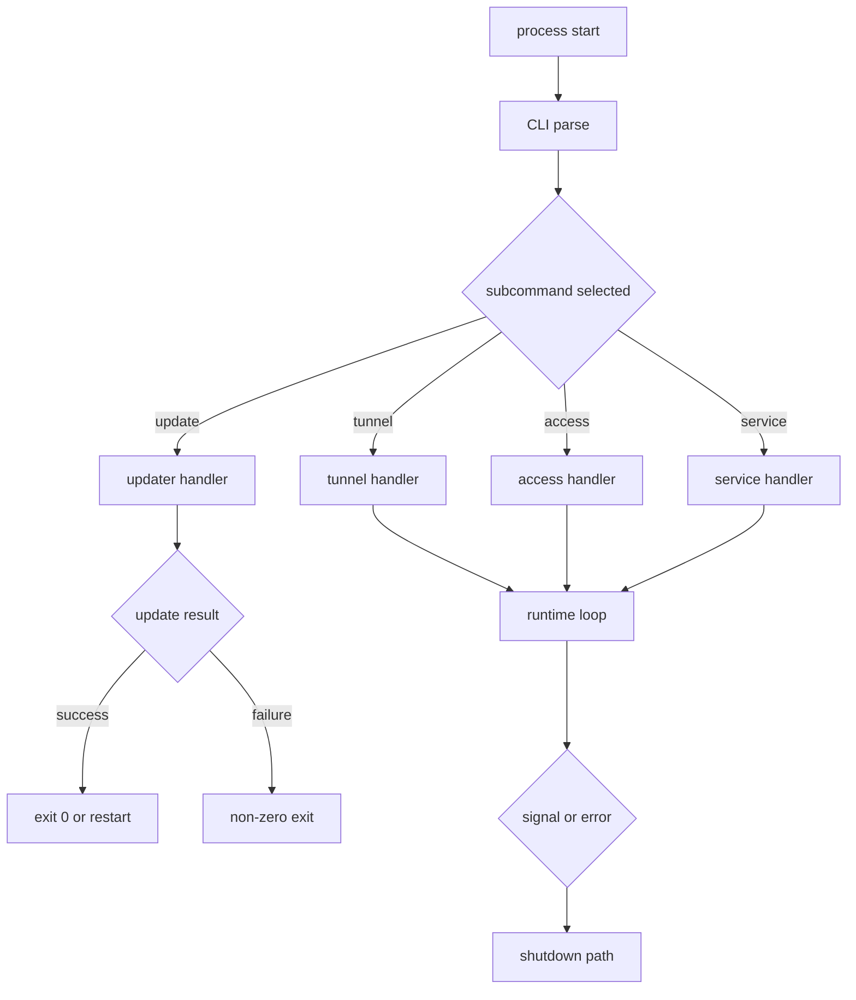
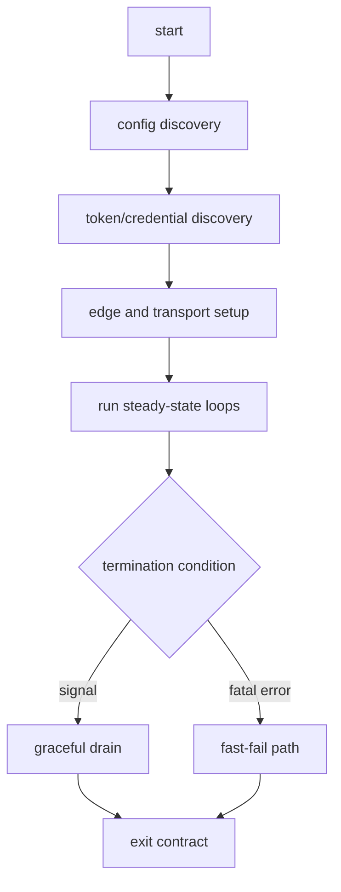
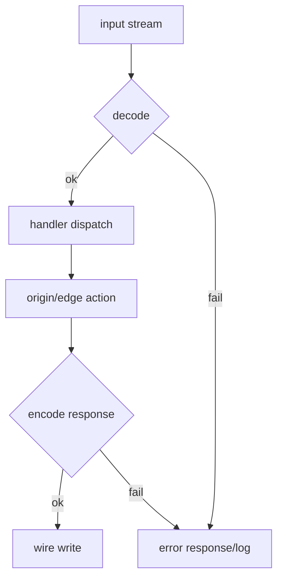

# Atom Graph Pass

## Command Dispatch Graph

```mermaid
flowchart TD
    A[process start] --> B[CLI parse]
    B --> C{subcommand selected}
    C -->|tunnel| D[tunnel handler]
    C -->|access| E[access handler]
    C -->|service| F[service handler]
    C -->|update| G[updater handler]
    D --> H[runtime loop]
    E --> H
    F --> H
    G --> I{update result}
    I -->|success| J[exit 0 or restart]
    I -->|failure| K[non-zero exit]
    H --> L{signal or error}
    L --> M[shutdown path]
```

## Startup and Shutdown Lifecycle Graph

```mermaid
flowchart TD
    S[start] --> C[config discovery]
    C --> T[token/credential discovery]
    T --> E[edge and transport setup]
    E --> R[run steady-state loops]
    R --> X{termination condition}
    X -->|signal| Q[graceful drain]
    X -->|fatal error| F[fast-fail path]
    Q --> Z[exit contract]
    F --> Z
```

## Control/Data Stream Behavior Graph

```mermaid
flowchart TD
    I[input stream] --> D{decode}
    D -->|ok| H[handler dispatch]
    D -->|fail| ER[error response/log]
    H --> O[origin/edge action]
    O --> EN{encode response}
    EN -->|ok| W[wire write]
    EN -->|fail| ER
```
