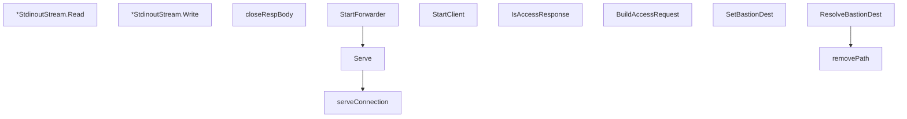

# Behavior Atom: carrier/carrier.go

## Source Anchor

- Go source: [cloudflare/cloudflared@2026.3.0/carrier/carrier.go](https://github.com/cloudflare/cloudflared/blob/2026.3.0/carrier/carrier.go)
- Package: carrier
- Module group: carrier

## Behavioral Responsibility

Core package behavior anchored to this source file.

## Entry Points

- (*StdinoutStream) Read(p []byte) (int, error) (line 49)
- (*StdinoutStream) Write(p []byte) (int, error) (line 54)
- StartForwarder(conn Connection, address string, shutdownC <-chan struct{}, options *StartOptions) error (line 67)
- StartClient(conn Connection, stream io.ReadWriter, options *StartOptions) error (line 77)
- Serve(remoteConn Connection, listener net.Listener, shutdownC <-chan struct{}, options *StartOptions) error (line 85)
- IsAccessResponse(resp *http.Response) bool (line 120)
- BuildAccessRequest(options *StartOptions, log*zerolog.Logger) (*http.Request, error) (line 137)
- SetBastionDest(header http.Header, destination string) (line 165)
- ResolveBastionDest(r *http.Request) (string, error) (line 171)

## Internal Function Surface

- closeRespBody(resp *http.Response) (line 59)
- serveConnection(remoteConn Connection, c net.Conn, options *StartOptions) (line 113)
- removePath(dest string) string (line 184)

## Input Contract

- HTTP requests
- func-param:address string
- func-param:c net.Conn
- func-param:conn Connection
- func-param:dest string
- func-param:destination string
- func-param:header http.Header
- func-param:listener net.Listener
- func-param:log *zerolog.Logger
- func-param:options *StartOptions
- func-param:p []byte
- func-param:r *http.Request
- func-param:remoteConn Connection
- func-param:resp *http.Response
- func-param:shutdownC <-chan struct{}
- func-param:stream io.ReadWriter
- stdin

## Output Contract

- HTTP response writes
- return:*http.Request
- return:bool
- return:error
- return:int
- return:string
- stdout/stderr or structured logs

## Side Effects and State Transitions

- network I/O
- concurrency primitives

## Branching and Failure Semantics

- Branch density: if=13, switch=0, select=2
- error-return paths
- fallback/default branches

## Import and Dependency Surface

- crypto/tls
- fmt
- github.com/cloudflare/cloudflared/token
- github.com/pkg/errors
- github.com/rs/zerolog
- io
- net
- net/http
- net/url
- os
- strings

## Go-Impl Flow (Intra-file)

## Accuracy Notes

- Generated from Go AST parsing and source text pattern extraction.
- Source link is authoritative for disputed semantics; keep this atom synchronized with the linked file.

## Rust Porting Notes

- **Stdin/stdout stream**: `StdinoutStream` wrapping OS stdin/stdout → `tokio::io::stdin()`/`tokio::io::stdout()` with `AsyncRead + AsyncWrite`.
- **WebSocket forwarding**: `StartForwarder` dials origin then pipes → `tokio-tungstenite` for WebSocket upgrade, then `tokio::io::copy_bidirectional`.
- **Shutdown channel**: `<-chan struct{}` → `tokio_util::sync::CancellationToken` passed to the serve loop.
- **Access request building**: `BuildAccessRequest` constructs HTTP request with token headers → `reqwest::Request` builder or manual `http::Request<Body>` construction.
- **Bastion header routing**: `SetBastionDest`/`ResolveBastionDest` manipulate HTTP headers → `http::HeaderMap` typed accessors.
- **Token acquisition**: `token.FetchTokenWithRedirect` dependency → async token fetch with file-lock coordination (see [atoms/token/token](../token/token.md)).
- **TLS dialing**: `crypto/tls` in carrier setup → `rustls` with custom `ServerName` for origin connections.
- **Quirk — select with 2 cases**: Shutdown-or-error select → `tokio::select!` on cancellation token and error channel.
