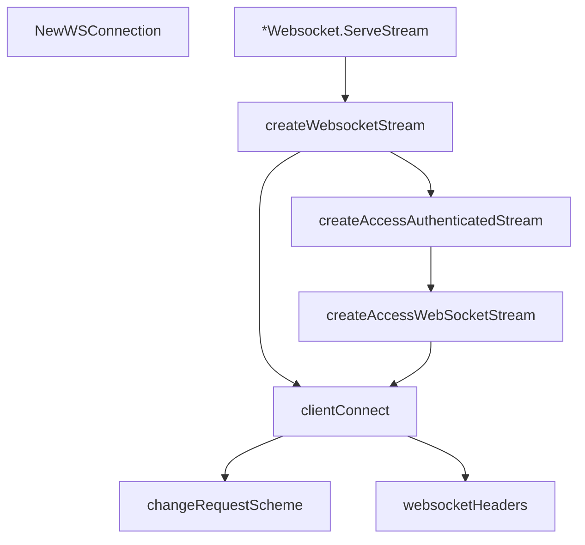

# Behavior Atom: carrier/websocket.go

## Source Anchor

- Go source: [cloudflare/cloudflared@2026.3.0/carrier/websocket.go](https://github.com/cloudflare/cloudflared/blob/2026.3.0/carrier/websocket.go)
- Package: carrier
- Module group: carrier

## Behavioral Responsibility

Core package behavior anchored to this source file.

## Entry Points

- NewWSConnection(log *zerolog.Logger) Connection (line 25)
- (*Websocket) ServeStream(options*StartOptions, conn io.ReadWriter) error (line 33)

## Internal Function Surface

- createWebsocketStream(options *StartOptions, log*zerolog.Logger) (*cfwebsocket.GorillaConn, error) (line 48)
- websocketHeaders(req *http.Request) http.Header (line 106)
- clientConnect(req *http.Request, dialler*websocket.Dialer) (*websocket.Conn,*http.Response, error) (line 122)
- changeRequestScheme(reqURL *url.URL) string (line 139)
- createAccessAuthenticatedStream(options *StartOptions, log*zerolog.Logger) (*websocket.Conn, error) (line 157)
- createAccessWebSocketStream(options *StartOptions, log*zerolog.Logger) (*websocket.Conn,*http.Response, error) (line 182)

## Input Contract

- HTTP requests
- func-param:conn io.ReadWriter
- func-param:dialler *websocket.Dialer
- func-param:log *zerolog.Logger
- func-param:options *StartOptions
- func-param:req *http.Request
- func-param:reqURL *url.URL

## Output Contract

- return:*cfwebsocket.GorillaConn
- return:*http.Response
- return:*websocket.Conn
- return:Connection
- return:error
- return:http.Header
- return:string
- stdout/stderr or structured logs

## Side Effects and State Transitions

- network I/O

## Branching and Failure Semantics

- Branch density: if=20, switch=1, select=0
- error-return paths
- fallback/default branches

## Import and Dependency Surface

- github.com/cloudflare/cloudflared/stream
- github.com/cloudflare/cloudflared/token
- github.com/cloudflare/cloudflared/websocket
- github.com/gorilla/websocket
- github.com/rs/zerolog
- io
- net/http
- net/http/httputil
- net/url

## Go-Impl Flow (Intra-file)

## Rust Porting Notes

- **WebSocket dial**: `gorilla/websocket.Dial` with multiple upgrade paths → `tokio_tungstenite::connect_async()` with custom `Request` builder.
- **Token-based auth**: Token header injection during WebSocket handshake → `http::Request::builder().header("Authorization", token)` passed to WS connect.
- **Quirk — 20 if-branches + 1 switch**: Multiple dial paths; consolidate with `match` on connection type enum.

## Accuracy Notes

- Generated from Go AST parsing and source text pattern extraction.
- Source link is authoritative for disputed semantics; keep this atom synchronized with the linked file.
