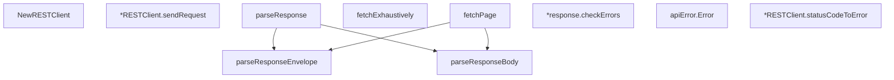

# Behavior Atom: cfapi/base_client.go

## Source Anchor

- Go source: [cloudflare/cloudflared@2026.3.0/cfapi/base_client.go](https://github.com/cloudflare/cloudflared/blob/2026.3.0/cfapi/base_client.go)
- Package: cfapi
- Module group: cfapi

## Behavioral Responsibility

Core package behavior anchored to this source file.

## Entry Points

- NewRESTClient(baseURL string, accountTag string, zoneTag string, authToken string, userAgent string, log *zerolog.Logger) (*RESTClient, error) (line 47)
- (apiError) Error() string (line 217)

## Internal Function Surface

- (*RESTClient) sendRequest(method string, url url.URL, body interface{}) (*http.Response, error) (line 87)
- parseResponseEnvelope(reader io.Reader) (*response, error) (line 110)
- parseResponse(reader io.Reader, data interface{}) error (line 128)
- parseResponseBody(result *response, data interface{}) error (line 137)
- fetchExhaustively(requestFn func(int) (*http.Response, error)) ([]*T, error) (line 146)
- fetchPage(requestFn func(int) (*http.Response, error), page int) (*response, []*T, error) (line 166)
- (*response) checkErrors() error (line 198)
- (*RESTClient) statusCodeToError(op string, resp*http.Response) error (line 221)

## Input Contract

- func-param:accountTag string
- func-param:authToken string
- func-param:baseURL string
- func-param:body interface{}
- func-param:data interface{}
- func-param:log *zerolog.Logger
- func-param:method string
- func-param:op string
- func-param:page int
- func-param:reader io.Reader
- func-param:requestFn func(int) (*http.Response, error)
- func-param:resp *http.Response
- func-param:result *response
- func-param:url url.URL
- func-param:userAgent string
- func-param:zoneTag string
- serialized configuration payloads

## Output Contract

- return:*RESTClient
- return:*http.Response
- return:*response
- return:[]*T
- return:error
- return:string
- stdout/stderr or structured logs

## Side Effects and State Transitions

- network I/O

## Branching and Failure Semantics

- Branch density: if=23, switch=1, select=0
- error-return paths

## Import and Dependency Surface

- bytes
- encoding/json
- fmt
- github.com/pkg/errors
- github.com/rs/zerolog
- golang.org/x/net/http2
- io
- net/http
- net/url
- strings
- time

## Go-Impl Flow (Intra-file)

## Rust Porting Notes

- **Generic paginated fetcher**: `fetchExhaustively[T any]` with Go generics → `async fn fetch_all<T: DeserializeOwned>(…) -> Result<Vec<T>>` with Rust generics.
- **HTTP/2 client**: `golang.org/x/net/http2` transport → `reqwest::Client` (h2 enabled by default) or `hyper` with h2.
- **JSON envelope parsing**: Nested `result`/`errors`/`messages` envelope → `#[derive(Deserialize)] struct ApiResponse<T> { result: T, errors: Vec<ApiError> }`.
- **Quirk — 23 if-branches**: Pagination + error handling; use async stream or `loop { … break }` with `?`.

## Accuracy Notes

- Generated from Go AST parsing and source text pattern extraction.
- Source link is authoritative for disputed semantics; keep this atom synchronized with the linked file.
