# Behavior Atom: cfapi/hostname.go

## Source Anchor

- Go source: [cloudflare/cloudflared@2026.3.0/cfapi/hostname.go](https://github.com/cloudflare/cloudflared/blob/2026.3.0/cfapi/hostname.go)
- Package: cfapi
- Module group: cfapi

## Behavioral Responsibility

Core package behavior anchored to this source file.

## Entry Points

- NewDNSRoute(userHostname string, overwriteExisting bool) HostnameRoute (line 46)
- (*DNSRoute) MarshalJSON() ([]byte, error) (line 53)
- (*DNSRoute) UnmarshalResult(body io.Reader) (HostnameRouteResult, error) (line 66)
- (*DNSRoute) RecordType() string (line 73)
- (*DNSRoute) String() string (line 77)
- (*DNSRouteResult) SuccessSummary() string (line 81)
- NewLBRoute(lbName string, lbPool string) HostnameRoute (line 114)
- (*LBRoute) MarshalJSON() ([]byte, error) (line 121)
- (*LBRoute) RecordType() string (line 134)
- (*LBRoute) String() string (line 138)
- (*LBRoute) UnmarshalResult(body io.Reader) (HostnameRouteResult, error) (line 142)
- (*LBRouteResult) SuccessSummary() string (line 149)
- (*RESTClient) RouteTunnel(tunnelID uuid.UUID, route HostnameRoute) (HostnameRouteResult, error) (line 178)

## Internal Function Surface

- (*DNSRouteResult) hostname() string (line 96)

## Input Contract

- func-param:body io.Reader
- func-param:lbName string
- func-param:lbPool string
- func-param:overwriteExisting bool
- func-param:route HostnameRoute
- func-param:tunnelID uuid.UUID
- func-param:userHostname string

## Output Contract

- return:HostnameRoute
- return:HostnameRouteResult
- return:[]byte
- return:error
- return:string

## Side Effects and State Transitions

- network I/O

## Branching and Failure Semantics

- Branch density: if=3, switch=2, select=0
- error-return paths
- fallback/default branches

## Import and Dependency Surface

- encoding/json
- fmt
- github.com/google/uuid
- github.com/pkg/errors
- io
- net/http
- path

## Go-Impl Flow (Intra-file)

```mermaid
flowchart TD
    F1["NewDNSRoute"]
    F2["*DNSRoute.MarshalJSON"]
    F3["*DNSRoute.UnmarshalResult"]
    F4["*DNSRoute.RecordType"]
    F5["*DNSRoute.String"]
    F6["*DNSRouteResult.SuccessSummary"]
    F7["*DNSRouteResult.hostname"]
    F8["NewLBRoute"]
    F9["*LBRoute.MarshalJSON"]
    F10["*LBRoute.RecordType"]
    F11["*LBRoute.String"]
    F12["*LBRoute.UnmarshalResult"]
    F13["*LBRouteResult.SuccessSummary"]
    F14["*RESTClient.RouteTunnel"]
    NOTE["No intra-file call edges detected; behavior may delegate externally"]
    F1 --> NOTE
```

## Rust Porting Notes

- **Polymorphic JSON**: `HostnameRoute` interface with DNS vs LB variants + `MarshalJSON/UnmarshalResult` → `#[serde(tag = "type")]` enum with custom deser via `#[serde(untagged)]` or manual `Deserialize` impl.
- **Switch dispatch**: Route type matching → `match route_type { … }` on enum variant.

## Accuracy Notes

- Generated from Go AST parsing and source text pattern extraction.
- Source link is authoritative for disputed semantics; keep this atom synchronized with the linked file.
