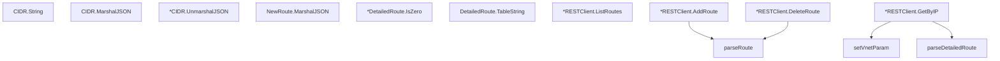

# Behavior Atom: cfapi/ip_route.go

## Source Anchor

- Go source: [cloudflare/cloudflared@2026.3.0/cfapi/ip_route.go](https://github.com/cloudflare/cloudflared/blob/2026.3.0/cfapi/ip_route.go)
- Package: cfapi
- Module group: cfapi

## Behavioral Responsibility

Core package behavior anchored to this source file.

## Entry Points

- (CIDR) String() string (line 35)
- (CIDR) MarshalJSON() ([]byte, error) (line 40)
- (*CIDR) UnmarshalJSON(data []byte) error (line 50)
- (NewRoute) MarshalJSON() ([]byte, error) (line 76)
- (*DetailedRoute) IsZero() bool (line 104)
- (DetailedRoute) TableString() string (line 110)
- (*RESTClient) ListRoutes(filter*IpRouteFilter) ([]*DetailedRoute, error) (line 141)
- (*RESTClient) AddRoute(newRoute NewRoute) (Route, error) (line 161)
- (*RESTClient) DeleteRoute(id uuid.UUID) error (line 178)
- (*RESTClient) GetByIP(params GetRouteByIpParams) (DetailedRoute, error) (line 197)

## Internal Function Surface

- parseRoute(body io.ReadCloser) (Route, error) (line 215)
- parseDetailedRoute(body io.ReadCloser) (DetailedRoute, error) (line 221)
- setVnetParam(endpoint *url.URL, vnetID*uuid.UUID) (line 229)

## Input Contract

- func-param:body io.ReadCloser
- func-param:data []byte
- func-param:endpoint *url.URL
- func-param:filter *IpRouteFilter
- func-param:id uuid.UUID
- func-param:newRoute NewRoute
- func-param:params GetRouteByIpParams
- func-param:vnetID *uuid.UUID
- serialized configuration payloads

## Output Contract

- return:DetailedRoute
- return:Route
- return:[]*DetailedRoute
- return:[]byte
- return:bool
- return:error
- return:string

## Side Effects and State Transitions

- network I/O

## Branching and Failure Semantics

- Branch density: if=15, switch=0, select=0
- error-return paths

## Import and Dependency Surface

- encoding/json
- fmt
- github.com/google/uuid
- github.com/pkg/errors
- io
- net
- net/http
- net/url
- path
- time

## Go-Impl Flow (Intra-file)

## Rust Porting Notes

- **Custom CIDR type**: `CIDR` wrapping `net.IPNet` with custom JSON marshal → `ipnet::IpNet` with `impl Serialize`/`Deserialize` (or newtype wrapper).
- **REST CRUD**: Create/List/Delete IP routes via HTTP → `reqwest` methods with typed request/response structs.
- **Quirk — 15 if-branches**: Error handling per CRUD op; chain with `?`.

## Accuracy Notes

- Generated from Go AST parsing and source text pattern extraction.
- Source link is authoritative for disputed semantics; keep this atom synchronized with the linked file.
