# Behavior Atom: cfapi/ip_route_filter.go

## Source Anchor

- Go source: [cloudflare/cloudflared@2026.3.0/cfapi/ip_route_filter.go](https://github.com/cloudflare/cloudflared/blob/2026.3.0/cfapi/ip_route_filter.go)
- Package: cfapi
- Module group: cfapi

## Behavioral Responsibility

Core package behavior anchored to this source file.

## Entry Points

- NewIpRouteFilterFromCLI(c *cli.Context) (*IpRouteFilter, error) (line 60)
- NewIPRouteFilter() *IpRouteFilter (line 125)
- (*IpRouteFilter) CommentIs(comment string) (line 134)
- (*IpRouteFilter) NotDeleted() (line 138)
- (*IpRouteFilter) Deleted() (line 142)
- (*IpRouteFilter) NetworkIsSubsetOf(superset net.IPNet) (line 146)
- (*IpRouteFilter) NetworkIsSupersetOf(subset net.IPNet) (line 150)
- (*IpRouteFilter) ExistedAt(existedAt time.Time) (line 154)
- (*IpRouteFilter) TunnelID(id uuid.UUID) (line 158)
- (*IpRouteFilter) VNetID(id uuid.UUID) (line 162)
- (*IpRouteFilter) MaxFetchSize(max uint) (line 166)
- (*IpRouteFilter) Page(page int) (line 170)
- (IpRouteFilter) Encode() string (line 174)

## Internal Function Surface

- cidrFromFlag(c *cli.Context, flag cli.StringFlag) (*net.IPNet, error) (line 110)

## Input Contract

- CLI flags and command arguments
- func-param:c *cli.Context
- func-param:comment string
- func-param:existedAt time.Time
- func-param:flag cli.StringFlag
- func-param:id uuid.UUID
- func-param:max uint
- func-param:page int
- func-param:subset net.IPNet
- func-param:superset net.IPNet

## Output Contract

- return:*IpRouteFilter
- return:*net.IPNet
- return:error
- return:string

## Side Effects and State Transitions

- network I/O

## Branching and Failure Semantics

- Branch density: if=14, switch=0, select=0
- error-return paths

## Import and Dependency Surface

- fmt
- github.com/google/uuid
- github.com/pkg/errors
- github.com/urfave/cli/v2
- net
- net/url
- strconv
- time

## Go-Impl Flow (Intra-file)

```mermaid
flowchart TD
    F1["NewIpRouteFilterFromCLI"]
    F2["cidrFromFlag"]
    F3["NewIPRouteFilter"]
    F4["*IpRouteFilter.CommentIs"]
    F5["*IpRouteFilter.NotDeleted"]
    F6["*IpRouteFilter.Deleted"]
    F7["*IpRouteFilter.NetworkIsSubsetOf"]
    F8["*IpRouteFilter.NetworkIsSupersetOf"]
    F9["*IpRouteFilter.ExistedAt"]
    F10["*IpRouteFilter.TunnelID"]
    F11["*IpRouteFilter.VNetID"]
    F12["*IpRouteFilter.MaxFetchSize"]
    F13["*IpRouteFilter.Page"]
    F14["IpRouteFilter.Encode"]
    F1 --> F3
    F1 --> F2
```

## Rust Porting Notes

- **CLI context binding**: `urfave/cli/v2.Context` for flag extraction → `clap::ArgMatches` or derive-macro struct.
- **URL query builder**: Filter fields encoded as URL params → `serde_urlencoded::to_string()` or manual `url::Url::query_pairs_mut()`.

## Accuracy Notes

- Generated from Go AST parsing and source text pattern extraction.
- Source link is authoritative for disputed semantics; keep this atom synchronized with the linked file.
