# Behavior Atom: cfapi/tunnel.go

## Source Anchor

- Go source: [cloudflare/cloudflared@2026.3.0/cfapi/tunnel.go](https://github.com/cloudflare/cloudflared/blob/2026.3.0/cfapi/tunnel.go)
- Package: cfapi
- Module group: cfapi

## Behavioral Responsibility

Core package behavior anchored to this source file.

## Entry Points

- (ManagementResource) String() string (line 26)
- NewCleanupParams() *CleanupParams (line 78)
- (*CleanupParams) ForClient(clientID uuid.UUID) (line 84)
- (*RESTClient) CreateTunnel(name string, tunnelSecret []byte) (*TunnelWithToken, error) (line 92)
- (*RESTClient) GetTunnel(tunnelID uuid.UUID) (*Tunnel, error) (line 124)
- (*RESTClient) GetTunnelToken(tunnelID uuid.UUID) (token string, err error) (line 140)
- (*RESTClient) GetManagementToken(tunnelID uuid.UUID, res ManagementResource) (token string, err error) (line 162)
- (*RESTClient) DeleteTunnel(tunnelID uuid.UUID, cascade bool) error (line 180)
- (*RESTClient) ListTunnels(filter*TunnelFilter) ([]*Tunnel, error) (line 197)
- (*RESTClient) ListActiveClients(tunnelID uuid.UUID) ([]*ActiveClient, error) (line 216)
- (*RESTClient) CleanupConnections(tunnelID uuid.UUID, params*CleanupParams) error (line 238)

## Internal Function Surface

- (CleanupParams) encode() string (line 88)
- managementEndpointPath(tunnelID uuid.UUID, res ManagementResource) string (line 158)
- parseConnectionsDetails(reader io.Reader) ([]*ActiveClient, error) (line 232)
- unmarshalTunnel(reader io.Reader) (*Tunnel, error) (line 251)

## Input Contract

- func-param:cascade bool
- func-param:clientID uuid.UUID
- func-param:filter *TunnelFilter
- func-param:name string
- func-param:params *CleanupParams
- func-param:reader io.Reader
- func-param:res ManagementResource
- func-param:tunnelID uuid.UUID
- func-param:tunnelSecret []byte

## Output Contract

- return:*CleanupParams
- return:*Tunnel
- return:*TunnelWithToken
- return:[]*ActiveClient
- return:[]*Tunnel
- return:err error
- return:error
- return:string
- return:token string

## Side Effects and State Transitions

- network I/O

## Branching and Failure Semantics

- Branch density: if=17, switch=2, select=0
- error-return paths
- fallback/default branches

## Import and Dependency Surface

- fmt
- github.com/google/uuid
- github.com/pkg/errors
- io
- net
- net/http
- net/url
- path
- time

## Go-Impl Flow (Intra-file)

```mermaid
flowchart TD
    F1["ManagementResource.String"]
    F2["NewCleanupParams"]
    F3["*CleanupParams.ForClient"]
    F4["CleanupParams.encode"]
    F5["*RESTClient.CreateTunnel"]
    F6["*RESTClient.GetTunnel"]
    F7["*RESTClient.GetTunnelToken"]
    F8["managementEndpointPath"]
    F9["*RESTClient.GetManagementToken"]
    F10["*RESTClient.DeleteTunnel"]
    F11["*RESTClient.ListTunnels"]
    F12["*RESTClient.ListActiveClients"]
    F13["parseConnectionsDetails"]
    F14["*RESTClient.CleanupConnections"]
    F15["unmarshalTunnel"]
    F6 --> F15
    F9 --> F8
    F12 --> F13
```

## Rust Porting Notes

- **Iota const with String()**: `ManagementResource` iota enum + `String()` method → `enum ManagementResource { … }` with `impl Display`.
- **REST CRUD + management token**: Tunnel management endpoints → `reqwest` with typed DTOs.
- **Quirk — 17 if-branches**: Error handling per endpoint; `Result` chain.

## Accuracy Notes

- Generated from Go AST parsing and source text pattern extraction.
- Source link is authoritative for disputed semantics; keep this atom synchronized with the linked file.
