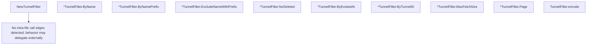

# Behavior Atom: cfapi/tunnel_filter.go

## Source Anchor

- Go source: [cloudflare/cloudflared@2026.3.0/cfapi/tunnel_filter.go](https://github.com/cloudflare/cloudflared/blob/2026.3.0/cfapi/tunnel_filter.go)
- Package: cfapi
- Module group: cfapi

## Behavioral Responsibility

Core package behavior anchored to this source file.

## Entry Points

- NewTunnelFilter() *TunnelFilter (line 19)
- (*TunnelFilter) ByName(name string) (line 25)
- (*TunnelFilter) ByNamePrefix(namePrefix string) (line 29)
- (*TunnelFilter) ExcludeNameWithPrefix(excludePrefix string) (line 33)
- (*TunnelFilter) NoDeleted() (line 37)
- (*TunnelFilter) ByExistedAt(existedAt time.Time) (line 41)
- (*TunnelFilter) ByTunnelID(tunnelID uuid.UUID) (line 45)
- (*TunnelFilter) MaxFetchSize(max uint) (line 49)
- (*TunnelFilter) Page(page int) (line 53)

## Internal Function Surface

- (TunnelFilter) encode() string (line 57)

## Input Contract

- func-param:excludePrefix string
- func-param:existedAt time.Time
- func-param:max uint
- func-param:name string
- func-param:namePrefix string
- func-param:page int
- func-param:tunnelID uuid.UUID

## Output Contract

- return:*TunnelFilter
- return:string

## Side Effects and State Transitions

- No high-signal side effect pattern detected in static scan.

## Branching and Failure Semantics

- Branch density: if=0, switch=0, select=0
- No explicit failure pattern markers found in static scan.

## Import and Dependency Surface

- github.com/google/uuid
- net/url
- strconv
- time

## Go-Impl Flow (Intra-file)

## Rust Porting Notes

- **Simple filter builder**: Struct fields → URL query params → direct Rust struct with `serde_urlencoded` serialization. Trivial.

## Accuracy Notes

- Generated from Go AST parsing and source text pattern extraction.
- Source link is authoritative for disputed semantics; keep this atom synchronized with the linked file.
