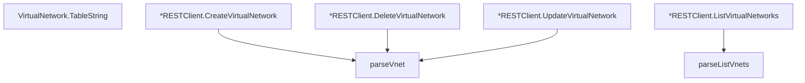

# Behavior Atom: cfapi/virtual_network.go

## Source Anchor

- Go source: [cloudflare/cloudflared@2026.3.0/cfapi/virtual_network.go](https://github.com/cloudflare/cloudflared/blob/2026.3.0/cfapi/virtual_network.go)
- Package: cfapi
- Module group: cfapi

## Behavioral Responsibility

Core package behavior anchored to this source file.

## Entry Points

- (VirtualNetwork) TableString() string (line 37)
- (*RESTClient) CreateVirtualNetwork(newVnet NewVirtualNetwork) (VirtualNetwork, error) (line 53)
- (*RESTClient) ListVirtualNetworks(filter*VnetFilter) ([]*VirtualNetwork, error) (line 67)
- (*RESTClient) DeleteVirtualNetwork(id uuid.UUID, force bool) error (line 83)
- (*RESTClient) UpdateVirtualNetwork(id uuid.UUID, updates UpdateVirtualNetwork) error (line 107)

## Internal Function Surface

- parseListVnets(body io.ReadCloser) ([]*VirtualNetwork, error) (line 124)
- parseVnet(body io.ReadCloser) (VirtualNetwork, error) (line 130)

## Input Contract

- func-param:body io.ReadCloser
- func-param:filter *VnetFilter
- func-param:force bool
- func-param:id uuid.UUID
- func-param:newVnet NewVirtualNetwork
- func-param:updates UpdateVirtualNetwork

## Output Contract

- return:VirtualNetwork
- return:[]*VirtualNetwork
- return:error
- return:string

## Side Effects and State Transitions

- network I/O

## Branching and Failure Semantics

- Branch density: if=10, switch=0, select=0
- error-return paths

## Import and Dependency Surface

- fmt
- github.com/google/uuid
- github.com/pkg/errors
- io
- net/http
- net/url
- path
- strconv
- time

## Go-Impl Flow (Intra-file)

## Rust Porting Notes

- **VNET CRUD**: REST create/list/update/delete via `net/http` → `reqwest` with typed request/response DTOs.
- **io.ReadCloser body**: `json.NewDecoder(resp.Body).Decode(&v)` → `resp.json::<T>().await` with `reqwest`.
- **Quirk — 10 if-branches**: Error handling per endpoint; standard `?` chain.

## Accuracy Notes

- Generated from Go AST parsing and source text pattern extraction.
- Source link is authoritative for disputed semantics; keep this atom synchronized with the linked file.
