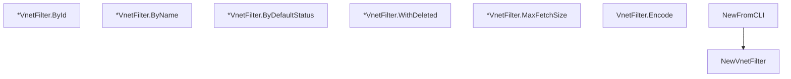

# Behavior Atom: cfapi/virtual_network_filter.go

## Source Anchor

- Go source: [cloudflare/cloudflared@2026.3.0/cfapi/virtual_network_filter.go](https://github.com/cloudflare/cloudflared/blob/2026.3.0/cfapi/virtual_network_filter.go)
- Package: cfapi
- Module group: cfapi

## Behavioral Responsibility

Core package behavior anchored to this source file.

## Entry Points

- NewVnetFilter() *VnetFilter (line 42)
- (*VnetFilter) ById(vnetId uuid.UUID) (line 48)
- (*VnetFilter) ByName(name string) (line 52)
- (*VnetFilter) ByDefaultStatus(isDefault bool) (line 56)
- (*VnetFilter) WithDeleted(isDeleted bool) (line 60)
- (*VnetFilter) MaxFetchSize(max uint) (line 64)
- (VnetFilter) Encode() string (line 68)
- NewFromCLI(c *cli.Context) (*VnetFilter, error) (line 73)

## Internal Function Surface

- None detected.

## Input Contract

- CLI flags and command arguments
- func-param:c *cli.Context
- func-param:isDefault bool
- func-param:isDeleted bool
- func-param:max uint
- func-param:name string
- func-param:vnetId uuid.UUID

## Output Contract

- return:*VnetFilter
- return:error
- return:string

## Side Effects and State Transitions

- No high-signal side effect pattern detected in static scan.

## Branching and Failure Semantics

- Branch density: if=5, switch=0, select=0
- error-return paths

## Import and Dependency Surface

- github.com/google/uuid
- github.com/pkg/errors
- github.com/urfave/cli/v2
- net/url
- strconv

## Go-Impl Flow (Intra-file)

## Rust Porting Notes

- **CLI binding + URL encode**: Same pattern as `ip_route_filter` → `clap` derive struct + `serde_urlencoded`.
- **Quirk — 5 if-branches**: Straightforward option-presence checks.

## Accuracy Notes

- Generated from Go AST parsing and source text pattern extraction.
- Source link is authoritative for disputed semantics; keep this atom synchronized with the linked file.
