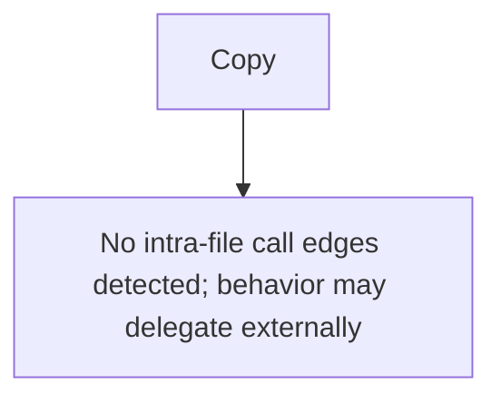

# Behavior Atom: cfio/copy.go

## Source Anchor

- Go source: [cloudflare/cloudflared@2026.3.0/cfio/copy.go](https://github.com/cloudflare/cloudflared/blob/2026.3.0/cfio/copy.go)
- Package: cfio
- Module group: cfio

## Behavioral Responsibility

Core package behavior anchored to this source file.

## Entry Points

- Copy(dst io.Writer, src io.Reader) (written int64, err error) (line 16)

## Internal Function Surface

- None detected.

## Input Contract

- func-param:dst io.Writer
- func-param:src io.Reader

## Output Contract

- return:err error
- return:written int64

## Side Effects and State Transitions

- concurrency primitives

## Branching and Failure Semantics

- Branch density: if=1, switch=0, select=0
- error-return paths

## Import and Dependency Surface

- io
- sync

## Go-Impl Flow (Intra-file)

## Rust Porting Notes

- **Bidirectional copy**: `sync.Once` for safe one-shot close during I/O copy → `tokio::io::copy_bidirectional()` or manual `select!` with `copy` futures.
- **Quirk — 1 if-branch**: Minimal branching; direct port.

## Accuracy Notes

- Generated from Go AST parsing and source text pattern extraction.
- Source link is authoritative for disputed semantics; keep this atom synchronized with the linked file.
