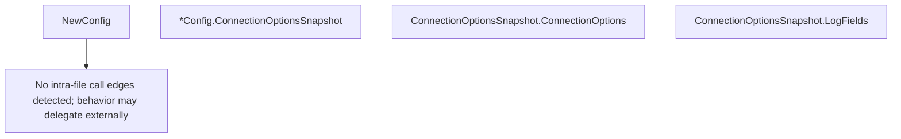

# Behavior Atom: client/config.go

## Source Anchor

- Go source: [cloudflare/cloudflared@2026.3.0/client/config.go](https://github.com/cloudflare/cloudflared/blob/2026.3.0/client/config.go)
- Package: client
- Module group: client

## Behavioral Responsibility

Core package behavior anchored to this source file.

## Entry Points

- NewConfig(version string, arch string, featureSelector features.FeatureSelector) (*Config, error) (line 23)
- (*Config) ConnectionOptionsSnapshot(originIP net.IP, previousAttempts uint8)*ConnectionOptionsSnapshot (line 47)
- (ConnectionOptionsSnapshot) ConnectionOptions() *pogs.ConnectionOptions (line 62)
- (ConnectionOptionsSnapshot) LogFields(event *zerolog.Event)*zerolog.Event (line 72)

## Internal Function Surface

- None detected.

## Input Contract

- func-param:arch string
- func-param:event *zerolog.Event
- func-param:featureSelector features.FeatureSelector
- func-param:originIP net.IP
- func-param:previousAttempts uint8
- func-param:version string

## Output Contract

- return:*Config
- return:*ConnectionOptionsSnapshot
- return:*pogs.ConnectionOptions
- return:*zerolog.Event
- return:error
- stdout/stderr or structured logs

## Side Effects and State Transitions

- network I/O

## Branching and Failure Semantics

- Branch density: if=1, switch=0, select=0
- error-return paths

## Import and Dependency Surface

- fmt
- github.com/cloudflare/cloudflared/features
- github.com/cloudflare/cloudflared/tunnelrpc/pogs
- github.com/google/uuid
- github.com/rs/zerolog
- net

## Go-Impl Flow (Intra-file)

## Rust Porting Notes

- **Feature selector**: `features.FeatureSelector` interface dependency → generic parameter `S: FeatureSelector` or trait object `dyn FeatureSelector`.
- **Cap’n Proto types**: `pogs` package for RPC config → `capnp` crate structs.
- **Quirk — 1 if-branch**: Minimal; direct translation.

## Accuracy Notes

- Generated from Go AST parsing and source text pattern extraction.
- Source link is authoritative for disputed semantics; keep this atom synchronized with the linked file.
