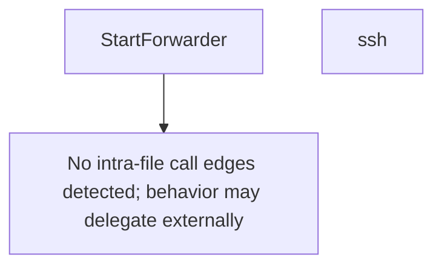

# Behavior Atom: cmd/cloudflared/access/carrier.go

## Source Anchor

- Go source: [cloudflare/cloudflared@2026.3.0/cmd/cloudflared/access/carrier.go](https://github.com/cloudflare/cloudflared/blob/2026.3.0/cmd/cloudflared/access/carrier.go)
- Package: access
- Module group: cmd

## Behavioral Responsibility

CLI command routing and operator-facing behavior surface.

## Entry Points

- StartForwarder(forwarder config.Forwarder, shutdown <-chan struct{}, log *zerolog.Logger) error (line 28)

## Internal Function Surface

- ssh(c *cli.Context) error (line 64)

## Input Contract

- CLI flags and command arguments
- func-param:c *cli.Context
- func-param:forwarder config.Forwarder
- func-param:log *zerolog.Logger
- func-param:shutdown <-chan struct{}

## Output Contract

- return:error
- stdout/stderr or structured logs

## Side Effects and State Transitions

- network I/O
- subprocess execution

## Branching and Failure Semantics

- Branch density: if=13, switch=1, select=0
- error-return paths
- fallback/default branches

## Import and Dependency Surface

- crypto/tls
- fmt
- github.com/cloudflare/cloudflared/carrier
- github.com/cloudflare/cloudflared/config
- github.com/cloudflare/cloudflared/logger
- github.com/cloudflare/cloudflared/stream
- github.com/cloudflare/cloudflared/validation
- github.com/pkg/errors
- github.com/rs/zerolog
- github.com/urfave/cli/v2
- io
- net/http
- strings

## Go-Impl Flow (Intra-file)

## Rust Porting Notes

- **SSH forwarding**: `StartForwarder()` spawns external `ssh` process → `tokio::process::Command` with stdout/stderr piping.
- **Carrier integration**: Uses `carrier` package for WebSocket tunnel → the Rust carrier module must expose an async `forward()` API.
- **Quirk — 13 if-branches**: Validation and error handling around ssh exec; flatten with `?` and typed error enum.

## Accuracy Notes

- Generated from Go AST parsing and source text pattern extraction.
- Source link is authoritative for disputed semantics; keep this atom synchronized with the linked file.
