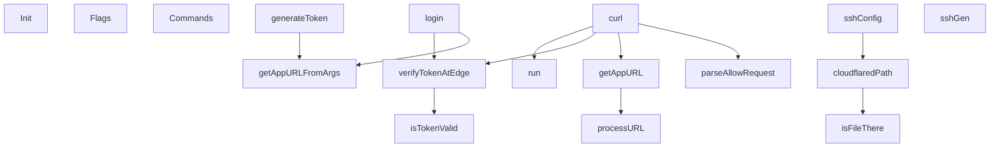

# Behavior Atom: cmd/cloudflared/access/cmd.go

## Source Anchor

- Go source: [cloudflare/cloudflared@2026.3.0/cmd/cloudflared/access/cmd.go](https://github.com/cloudflare/cloudflared/blob/2026.3.0/cmd/cloudflared/access/cmd.go)
- Package: access
- Module group: cmd

## Behavioral Responsibility

CLI command routing and operator-facing behavior surface.

## Entry Points

- Init(shutdown chan struct{}, version string) (line 65)
- Flags() []cli.Flag (line 71)
- Commands() []*cli.Command (line 76)

## Internal Function Surface

- login(c *cli.Context) error (line 243)
- curl(c *cli.Context) error (line 295)
- run(cmd string, args ...string) error (line 347)
- getAppURLFromArgs(c *cli.Context) (*url.URL, error) (line 368)
- generateToken(c *cli.Context) error (line 380)
- sshConfig(c *cli.Context) error (line 412)
- sshGen(c *cli.Context) error (line 431)
- getAppURL(cmdArgs []string, log *zerolog.Logger) (*url.URL, error) (line 467)
- parseAllowRequest(cmdArgs []string) ([]string, bool) (line 484)
- processURL(s string) (*url.URL, error) (line 495)
- cloudflaredPath() string (line 519)
- isFileThere(candidate string) bool (line 535)
- verifyTokenAtEdge(appUrl *url.URL, appInfo*token.AppInfo, c *cli.Context, log*zerolog.Logger) error (line 546)
- isTokenValid(options *carrier.StartOptions, log*zerolog.Logger) (bool, error) (line 576)

## Input Contract

- CLI flags and command arguments
- HTTP requests
- environment variables
- func-param:appInfo *token.AppInfo
- func-param:appUrl *url.URL
- func-param:args ...string
- func-param:c *cli.Context
- func-param:candidate string
- func-param:cmd string
- func-param:cmdArgs []string
- func-param:log *zerolog.Logger
- func-param:options *carrier.StartOptions
- func-param:s string
- func-param:shutdown chan struct{}
- func-param:version string
- stdin

## Output Contract

- return:*url.URL
- return:[]*cli.Command
- return:[]cli.Flag
- return:[]string
- return:bool
- return:error
- return:string
- stdout/stderr or structured logs

## Side Effects and State Transitions

- network I/O
- subprocess execution
- concurrency primitives

## Branching and Failure Semantics

- Branch density: if=50, switch=0, select=0
- error-return paths

## Import and Dependency Surface

- fmt
- github.com/cloudflare/cloudflared/carrier
- github.com/cloudflare/cloudflared/cmd/cloudflared/cliutil
- github.com/cloudflare/cloudflared/cmd/cloudflared/flags
- github.com/cloudflare/cloudflared/logger
- github.com/cloudflare/cloudflared/sshgen
- github.com/cloudflare/cloudflared/token
- github.com/cloudflare/cloudflared/validation
- github.com/getsentry/sentry-go
- github.com/pkg/errors
- github.com/rs/zerolog
- github.com/urfave/cli/v2
- golang.org/x/net/idna
- io
- net/http
- net/url
- os
- os/exec
- strings
- text/template
- time

## Go-Impl Flow (Intra-file)

## Rust Porting Notes

- **CLI subcommand factory**: `Commands()` returns cli subcommands → `clap::Command` builders with `.subcommand()` chains.
- **Token flow**: `login()`, `generateToken()`, `verifyTokenAtEdge()` orchestrate OAuth-style browser flow → async functions returning `Result<Token>` with browser-launch and callback server.
- **Quirk — 50 if-branches**: Complex validation across multiple auth paths; decompose into per-subcommand handler functions with `?` error propagation.

## Accuracy Notes

- Generated from Go AST parsing and source text pattern extraction.
- Source link is authoritative for disputed semantics; keep this atom synchronized with the linked file.
