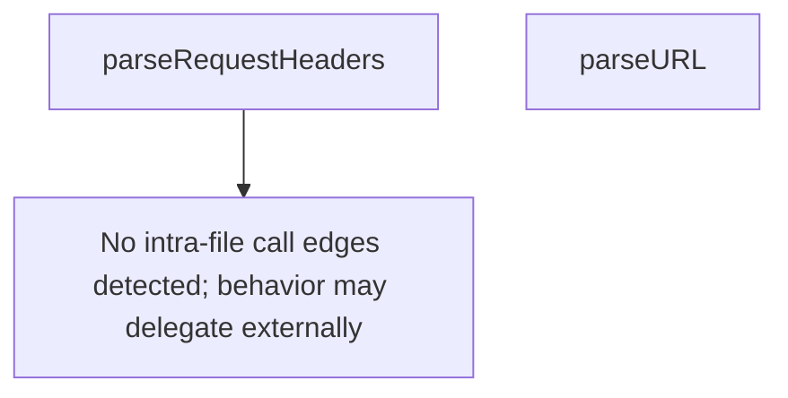

# Behavior Atom: cmd/cloudflared/access/validation.go

## Source Anchor

- Go source: [cloudflare/cloudflared@2026.3.0/cmd/cloudflared/access/validation.go](https://github.com/cloudflare/cloudflared/blob/2026.3.0/cmd/cloudflared/access/validation.go)
- Package: access
- Module group: cmd

## Behavioral Responsibility

CLI command routing and operator-facing behavior surface.

## Entry Points

- No exported/main/init entry point detected; behavior is internal support logic.

## Internal Function Surface

- parseRequestHeaders(values []string) http.Header (line 15)
- parseURL(input string) (*url.URL, error) (line 29)

## Input Contract

- func-param:input string
- func-param:values []string

## Output Contract

- return:*url.URL
- return:error
- return:http.Header

## Side Effects and State Transitions

- network I/O

## Branching and Failure Semantics

- Branch density: if=8, switch=0, select=0
- error-return paths

## Import and Dependency Surface

- errors
- fmt
- golang.org/x/net/http/httpguts
- net/http
- net/url
- strings

## Go-Impl Flow (Intra-file)

## Rust Porting Notes

- **Header parsing**: `parseRequestHeaders()` validates HTTP headers per RFC → use `http::HeaderName::from_str()` + `http::HeaderValue::from_str()` which enforce RFC 7230 rules.
- **URL mutation**: `parseURL()` normalizes and validates URLs → `url::Url::parse()` from the `url` crate with scheme defaulting logic.
- **Quirk — httpguts dependency**: Go's `golang.org/x/net/http/httpguts` for header validation → Rust's `http` crate provides equivalent validation in its type constructors.

## Accuracy Notes

- Generated from Go AST parsing and source text pattern extraction.
- Source link is authoritative for disputed semantics; keep this atom synchronized with the linked file.
