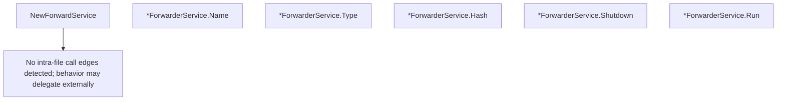

# Behavior Atom: cmd/cloudflared/app_forward_service.go

## Source Anchor

- Go source: [cloudflare/cloudflared@2026.3.0/cmd/cloudflared/app_forward_service.go](https://github.com/cloudflare/cloudflared/blob/2026.3.0/cmd/cloudflared/app_forward_service.go)
- Package: main
- Module group: cmd

## Behavioral Responsibility

CLI command routing and operator-facing behavior surface.

## Entry Points

- NewForwardService(f config.Forwarder, log *zerolog.Logger)*ForwarderService (line 23)
- (*ForwarderService) Name() string (line 29)
- (*ForwarderService) Type() string (line 34)
- (*ForwarderService) Hash() string (line 39)
- (*ForwarderService) Shutdown() (line 44)
- (*ForwarderService) Run() error (line 49)

## Internal Function Surface

- None detected.

## Input Contract

- func-param:f config.Forwarder
- func-param:log *zerolog.Logger

## Output Contract

- return:*ForwarderService
- return:error
- return:string
- stdout/stderr or structured logs

## Side Effects and State Transitions

- network I/O

## Branching and Failure Semantics

- Branch density: if=0, switch=0, select=0
- No explicit failure pattern markers found in static scan.

## Import and Dependency Surface

- github.com/cloudflare/cloudflared/cmd/cloudflared/access
- github.com/cloudflare/cloudflared/config
- github.com/rs/zerolog

## Go-Impl Flow (Intra-file)

## Rust Porting Notes

- **Service lifecycle**: `Run()` / `Shutdown()` pattern → implement a trait `Service { async fn run(&self, cancel: CancellationToken) -> Result<()>; }` with cooperative shutdown.
- **Hash for config diffing**: `Hash()` computes config fingerprint → derive or implement `Hash` on the config struct for change detection.
- **Quirk — zero branching**: Pure lifecycle orchestration; the Rust port should be a thin async runner.

## Accuracy Notes

- Generated from Go AST parsing and source text pattern extraction.
- Source link is authoritative for disputed semantics; keep this atom synchronized with the linked file.
