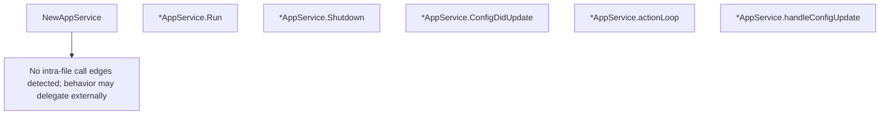

# Behavior Atom: cmd/cloudflared/app_service.go

## Source Anchor

- Go source: [cloudflare/cloudflared@2026.3.0/cmd/cloudflared/app_service.go](https://github.com/cloudflare/cloudflared/blob/2026.3.0/cmd/cloudflared/app_service.go)
- Package: main
- Module group: cmd

## Behavioral Responsibility

CLI command routing and operator-facing behavior surface.

## Entry Points

- NewAppService(configManager config.Manager, serviceManager overwatch.Manager, shutdownC chan struct{}, log *zerolog.Logger)*AppService (line 21)
- (*AppService) Run() error (line 32)
- (*AppService) Shutdown() error (line 38)
- (*AppService) ConfigDidUpdate(c config.Root) (line 48)

## Internal Function Surface

- (*AppService) actionLoop() (line 53)
- (*AppService) handleConfigUpdate(c config.Root) (line 67)

## Input Contract

- func-param:c config.Root
- func-param:configManager config.Manager
- func-param:log *zerolog.Logger
- func-param:serviceManager overwatch.Manager
- func-param:shutdownC chan struct{}

## Output Contract

- return:*AppService
- return:error
- stdout/stderr or structured logs

## Side Effects and State Transitions

- No high-signal side effect pattern detected in static scan.

## Branching and Failure Semantics

- Branch density: if=1, switch=0, select=1
- No explicit failure pattern markers found in static scan.

## Import and Dependency Surface

- github.com/cloudflare/cloudflared/config
- github.com/cloudflare/cloudflared/overwatch
- github.com/rs/zerolog

## Go-Impl Flow (Intra-file)

## Rust Porting Notes

- **Config push channel**: `actionLoop()` uses `select` on config-update channel → `tokio::select!` over `mpsc::Receiver<Config>` and cancellation token.
- **Atomic config swap**: `handleConfigUpdate()` hot-swaps config → `Arc<ArcSwap<Config>>` or `tokio::sync::watch` channel for lock-free config reads.
- **Overwatch integration**: Depends on `overwatch` app manager → trait-based app registration.

## Accuracy Notes

- Generated from Go AST parsing and source text pattern extraction.
- Source link is authoritative for disputed semantics; keep this atom synchronized with the linked file.
