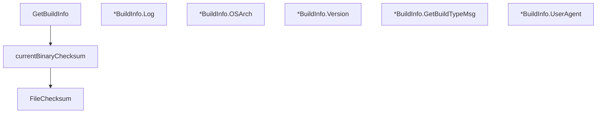

# Behavior Atom: cmd/cloudflared/cliutil/build_info.go

## Source Anchor

- Go source: [cloudflare/cloudflared@2026.3.0/cmd/cloudflared/cliutil/build_info.go](https://github.com/cloudflare/cloudflared/blob/2026.3.0/cmd/cloudflared/cliutil/build_info.go)
- Package: cliutil
- Module group: cmd

## Behavioral Responsibility

CLI command routing and operator-facing behavior surface.

## Entry Points

- GetBuildInfo(buildType string, version string) *BuildInfo (line 22)
- (*BuildInfo) Log(log*zerolog.Logger) (line 33)
- (*BuildInfo) OSArch() string (line 41)
- (*BuildInfo) Version() string (line 45)
- (*BuildInfo) GetBuildTypeMsg() string (line 49)
- (*BuildInfo) UserAgent() string (line 56)
- FileChecksum(filePath string) (string, error) (line 61)

## Internal Function Surface

- currentBinaryChecksum() string (line 76)

## Input Contract

- func-param:buildType string
- func-param:filePath string
- func-param:log *zerolog.Logger
- func-param:version string

## Output Contract

- return:*BuildInfo
- return:error
- return:string
- stdout/stderr or structured logs

## Side Effects and State Transitions

- filesystem I/O

## Branching and Failure Semantics

- Branch density: if=5, switch=0, select=0
- error-return paths

## Import and Dependency Surface

- crypto/sha256
- fmt
- github.com/rs/zerolog
- io
- os
- runtime

## Go-Impl Flow (Intra-file)

## Rust Porting Notes

- **Build info introspection**: `GetBuildInfo()` reads runtime build metadata → use `env!("CARGO_PKG_VERSION")` and build-time constants via `build.rs` or the `built` crate.
- **Binary checksum**: `FileChecksum()` / `currentBinaryChecksum()` SHA256 self-hash → `sha2::Sha256` digest of `std::env::current_exe()` file contents.
- **Quirk — 5 if-branches**: Error handling around file reads; use `?` operator.

## Accuracy Notes

- Generated from Go AST parsing and source text pattern extraction.
- Source link is authoritative for disputed semantics; keep this atom synchronized with the linked file.
