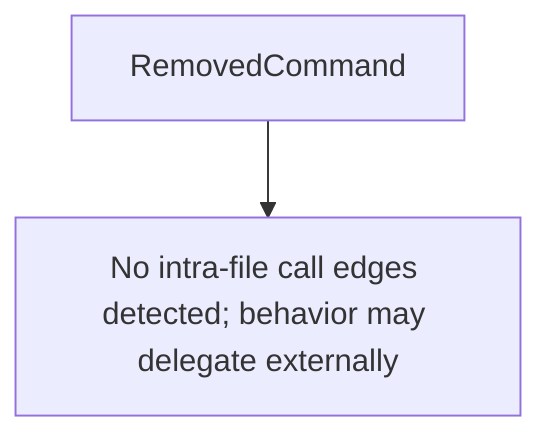

# Behavior Atom: cmd/cloudflared/cliutil/deprecated.go

## Source Anchor

- Go source: [cloudflare/cloudflared@2026.3.0/cmd/cloudflared/cliutil/deprecated.go](https://github.com/cloudflare/cloudflared/blob/2026.3.0/cmd/cloudflared/cliutil/deprecated.go)
- Package: cliutil
- Module group: cmd

## Behavioral Responsibility

CLI command routing and operator-facing behavior surface.

## Entry Points

- RemovedCommand(name string) *cli.Command (line 9)

## Internal Function Surface

- None detected.

## Input Contract

- CLI flags and command arguments
- func-param:name string

## Output Contract

- return:*cli.Command

## Side Effects and State Transitions

- subprocess execution

## Branching and Failure Semantics

- Branch density: if=0, switch=0, select=0
- No explicit failure pattern markers found in static scan.

## Import and Dependency Surface

- fmt
- github.com/urfave/cli/v2

## Go-Impl Flow (Intra-file)

## Rust Porting Notes

- **Removed command stub**: `RemovedCommand()` returns a CLI command that only prints an error → `clap::Command` with a custom action that returns `Err("command removed")`.
- **Quirk — zero branching**: Trivial factory; direct translation.

## Accuracy Notes

- Generated from Go AST parsing and source text pattern extraction.
- Source link is authoritative for disputed semantics; keep this atom synchronized with the linked file.
