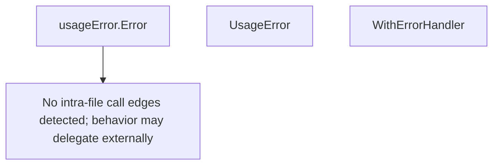

# Behavior Atom: cmd/cloudflared/cliutil/errors.go

## Source Anchor

- Go source: [cloudflare/cloudflared@2026.3.0/cmd/cloudflared/cliutil/errors.go](https://github.com/cloudflare/cloudflared/blob/2026.3.0/cmd/cloudflared/cliutil/errors.go)
- Package: cliutil
- Module group: cmd

## Behavioral Responsibility

CLI command routing and operator-facing behavior surface.

## Entry Points

- (usageError) Error() string (line 11)
- UsageError(format string, args ...interface{}) error (line 15)
- WithErrorHandler(actionFunc cli.ActionFunc) cli.ActionFunc (line 25)

## Internal Function Surface

- None detected.

## Input Contract

- CLI flags and command arguments
- func-param:actionFunc cli.ActionFunc
- func-param:args ...interface{}
- func-param:format string

## Output Contract

- return:cli.ActionFunc
- return:error
- return:string

## Side Effects and State Transitions

- subprocess execution

## Branching and Failure Semantics

- Branch density: if=4, switch=0, select=0
- error-return paths

## Import and Dependency Surface

- fmt
- github.com/urfave/cli/v2

## Go-Impl Flow (Intra-file)

## Rust Porting Notes

- **UsageError type**: Custom error with usage display → `#[derive(thiserror::Error)] struct UsageError(String)` with `Display` impl.
- **WithErrorHandler wrapper**: Wraps CLI action with error handling → higher-order function `fn with_error_handler<F: Fn() -> Result<()>>(f: F) -> impl Fn() -> Result<()>`.
- **Quirk — 4 if-branches**: Error type checking; use `match` on error variants.

## Accuracy Notes

- Generated from Go AST parsing and source text pattern extraction.
- Source link is authoritative for disputed semantics; keep this atom synchronized with the linked file.
