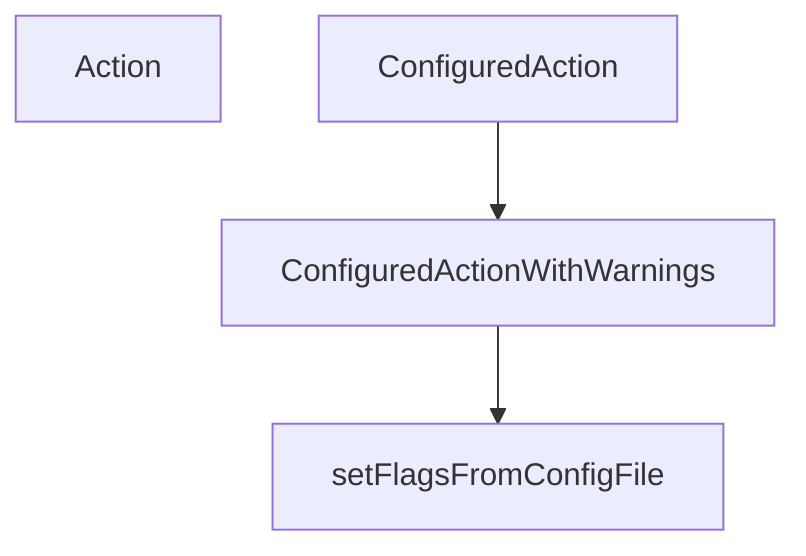

# Behavior Atom: cmd/cloudflared/cliutil/handler.go

## Source Anchor

- Go source: [cloudflare/cloudflared@2026.3.0/cmd/cloudflared/cliutil/handler.go](https://github.com/cloudflare/cloudflared/blob/2026.3.0/cmd/cloudflared/cliutil/handler.go)
- Package: cliutil
- Module group: cmd

## Behavioral Responsibility

CLI command routing and operator-facing behavior surface.

## Entry Points

- Action(actionFunc cli.ActionFunc) cli.ActionFunc (line 11)
- ConfiguredAction(actionFunc cli.ActionFunc) cli.ActionFunc (line 15)
- ConfiguredActionWithWarnings(actionFunc func(*cli.Context, string) error) cli.ActionFunc (line 25)

## Internal Function Surface

- setFlagsFromConfigFile(c *cli.Context) (configWarnings string, err error) (line 35)

## Input Contract

- CLI flags and command arguments
- func-param:actionFunc cli.ActionFunc
- func-param:actionFunc func(*cli.Context, string) error
- func-param:c *cli.Context

## Output Contract

- return:cli.ActionFunc
- return:configWarnings string
- return:err error
- stdout/stderr or structured logs

## Side Effects and State Transitions

- No high-signal side effect pattern detected in static scan.

## Branching and Failure Semantics

- Branch density: if=4, switch=0, select=0
- error-return paths

## Import and Dependency Surface

- github.com/cloudflare/cloudflared/config
- github.com/cloudflare/cloudflared/logger
- github.com/urfave/cli/v2
- github.com/urfave/cli/v2/altsrc

## Go-Impl Flow (Intra-file)

## Rust Porting Notes

- **Config file flag override**: `setFlagsFromConfigFile()` uses `altsrc` reflection-like flag sourcing → in Rust, use `config` crate layered sources (CLI > file > env) or manual merge logic.
- **Action wrapper**: `Action()` / `ConfiguredAction()` wrap CLI handlers → generic function `fn configured_action<F>(f: F) -> impl Fn(&ArgMatches) -> Result<()>` that loads config first.
- **Quirk — altsrc reflection**: Go's `altsrc` dynamically overrides flag values; Rust needs explicit source priority composition.

## Accuracy Notes

- Generated from Go AST parsing and source text pattern extraction.
- Source link is authoritative for disputed semantics; keep this atom synchronized with the linked file.
