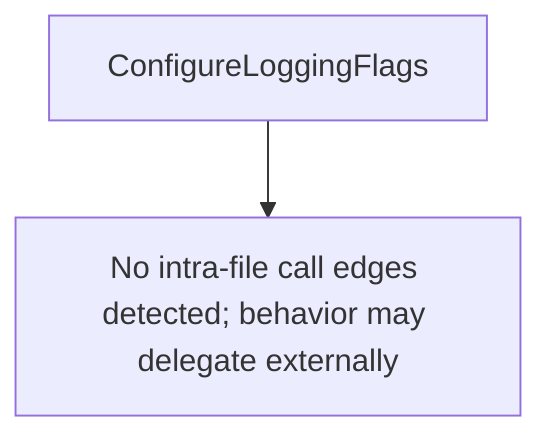

# Behavior Atom: cmd/cloudflared/cliutil/logger.go

## Source Anchor

- Go source: [cloudflare/cloudflared@2026.3.0/cmd/cloudflared/cliutil/logger.go](https://github.com/cloudflare/cloudflared/blob/2026.3.0/cmd/cloudflared/cliutil/logger.go)
- Package: cliutil
- Module group: cmd

## Behavioral Responsibility

CLI command routing and operator-facing behavior surface.

## Entry Points

- ConfigureLoggingFlags(shouldHide bool) []cli.Flag (line 22)

## Internal Function Surface

- None detected.

## Input Contract

- CLI flags and command arguments
- func-param:shouldHide bool

## Output Contract

- return:[]cli.Flag

## Side Effects and State Transitions

- No high-signal side effect pattern detected in static scan.

## Branching and Failure Semantics

- Branch density: if=0, switch=0, select=0
- No explicit failure pattern markers found in static scan.

## Import and Dependency Surface

- github.com/cloudflare/cloudflared/cmd/cloudflared/flags
- github.com/urfave/cli/v2
- github.com/urfave/cli/v2/altsrc

## Go-Impl Flow (Intra-file)

## Rust Porting Notes

- **Logging flag builder**: `ConfigureLoggingFlags()` defines CLI flags for log level/format → `clap::Arg` definitions for `--loglevel`, `--logfile`, etc.
- **Quirk — zero branching**: Pure flag definition; direct translation to `clap` arg builders.

## Accuracy Notes

- Generated from Go AST parsing and source text pattern extraction.
- Source link is authoritative for disputed semantics; keep this atom synchronized with the linked file.
