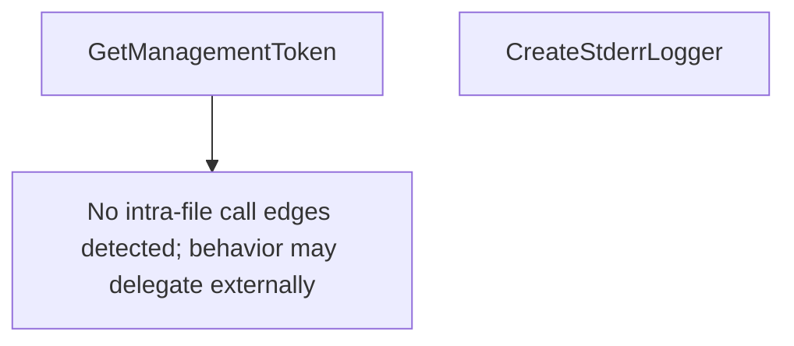

# Behavior Atom: cmd/cloudflared/cliutil/management.go

## Source Anchor

- Go source: [cloudflare/cloudflared@2026.3.0/cmd/cloudflared/cliutil/management.go](https://github.com/cloudflare/cloudflared/blob/2026.3.0/cmd/cloudflared/cliutil/management.go)
- Package: cliutil
- Module group: cmd

## Behavioral Responsibility

CLI command routing and operator-facing behavior surface.

## Entry Points

- GetManagementToken(c *cli.Context, log*zerolog.Logger, res cfapi.ManagementResource, buildInfo *BuildInfo) (string, error) (line 27)
- CreateStderrLogger(c *cli.Context)*zerolog.Logger (line 63)

## Internal Function Surface

- None detected.

## Input Contract

- CLI flags and command arguments
- func-param:buildInfo *BuildInfo
- func-param:c *cli.Context
- func-param:log *zerolog.Logger
- func-param:res cfapi.ManagementResource

## Output Contract

- return:*zerolog.Logger
- return:error
- return:string
- stdout/stderr or structured logs

## Side Effects and State Transitions

- No high-signal side effect pattern detected in static scan.

## Branching and Failure Semantics

- Branch density: if=7, switch=1, select=0
- error-return paths
- fallback/default branches

## Import and Dependency Surface

- errors
- fmt
- github.com/cloudflare/cloudflared/cfapi
- github.com/cloudflare/cloudflared/cmd/cloudflared/flags
- github.com/cloudflare/cloudflared/credentials
- github.com/google/uuid
- github.com/mattn/go-colorable
- github.com/rs/zerolog
- github.com/urfave/cli/v2
- io
- os
- time

## Go-Impl Flow (Intra-file)

## Rust Porting Notes

- **Management token retrieval**: `GetManagementToken()` looks up credentials with fallback chain → `async fn get_management_token(config: &Config) -> Result<Token>` with sequential fallback.
- **Stderr logger**: `CreateStderrLogger()` with color support → `tracing_subscriber::fmt().with_writer(std::io::stderr).with_ansi(true).init()`.
- **Quirk — 7 if-branches**: Credential lookup fallback; use `Option::or_else()` chains or early-return `?`.

## Accuracy Notes

- Generated from Go AST parsing and source text pattern extraction.
- Source link is authoritative for disputed semantics; keep this atom synchronized with the linked file.
