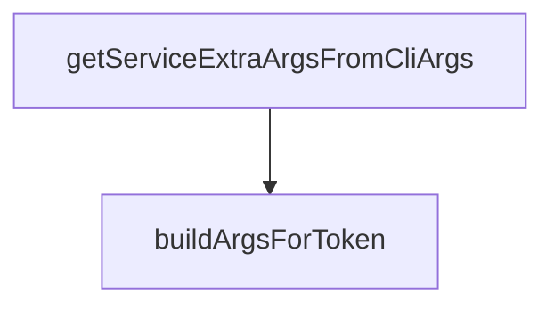

# Behavior Atom: cmd/cloudflared/common_service.go

## Source Anchor

- Go source: [cloudflare/cloudflared@2026.3.0/cmd/cloudflared/common_service.go](https://github.com/cloudflare/cloudflared/blob/2026.3.0/cmd/cloudflared/common_service.go)
- Package: main
- Module group: cmd

## Behavioral Responsibility

CLI command routing and operator-facing behavior surface.

## Entry Points

- No exported/main/init entry point detected; behavior is internal support logic.

## Internal Function Surface

- buildArgsForToken(c *cli.Context, log*zerolog.Logger) ([]string, error) (line 11)
- getServiceExtraArgsFromCliArgs(c *cli.Context, log*zerolog.Logger) ([]string, error) (line 22)

## Input Contract

- CLI flags and command arguments
- func-param:c *cli.Context
- func-param:log *zerolog.Logger

## Output Contract

- return:[]string
- return:error
- stdout/stderr or structured logs

## Side Effects and State Transitions

- No high-signal side effect pattern detected in static scan.

## Branching and Failure Semantics

- Branch density: if=2, switch=0, select=0
- error-return paths

## Import and Dependency Surface

- github.com/cloudflare/cloudflared/cmd/cloudflared/cliutil
- github.com/cloudflare/cloudflared/cmd/cloudflared/tunnel
- github.com/rs/zerolog
- github.com/urfave/cli/v2

## Go-Impl Flow (Intra-file)

## Rust Porting Notes

- **Service arg builders**: `buildArgsForToken()` / `getServiceExtraArgsFromCliArgs()` extract CLI args for service installation → helper functions returning `Vec<String>` or `Vec<OsString>`.
- **Quirk — internal helper**: Thin CLI-to-service argument translation; direct port.

## Accuracy Notes

- Generated from Go AST parsing and source text pattern extraction.
- Source link is authoritative for disputed semantics; keep this atom synchronized with the linked file.
