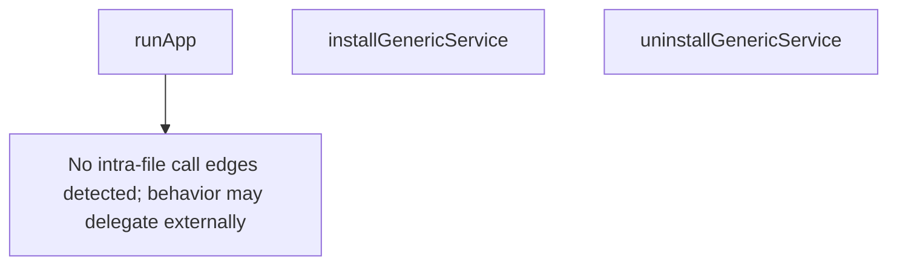

# Behavior Atom: cmd/cloudflared/generic_service.go

## Source Anchor

- Go source: [cloudflare/cloudflared@2026.3.0/cmd/cloudflared/generic_service.go](https://github.com/cloudflare/cloudflared/blob/2026.3.0/cmd/cloudflared/generic_service.go)
- Package: main
- Module group: cmd

## Behavioral Responsibility

CLI command routing and operator-facing behavior surface.

## Entry Points

- No exported/main/init entry point detected; behavior is internal support logic.

## Internal Function Surface

- runApp(app *cli.App, graceShutdownC chan struct{}) (line 14)
- installGenericService(c *cli.Context) error (line 34)
- uninstallGenericService(c *cli.Context) error (line 38)

## Input Contract

- CLI flags and command arguments
- func-param:app *cli.App
- func-param:c *cli.Context
- func-param:graceShutdownC chan struct{}

## Output Contract

- return:error

## Side Effects and State Transitions

- subprocess execution

## Branching and Failure Semantics

- Branch density: if=0, switch=0, select=0
- No explicit failure pattern markers found in static scan.

## Import and Dependency Surface

- fmt
- github.com/cloudflare/cloudflared/cmd/cloudflared/cliutil
- github.com/urfave/cli/v2
- os

## Go-Impl Flow (Intra-file)

## Rust Porting Notes

- **Platform dispatch**: `runApp()` + `installGenericService()` / `uninstallGenericService()` delegate to platform-specific impls → use `#[cfg(target_os = "...")]` conditional compilation to select the platform service installer.
- **Quirk — zero branching**: Generic entry point only; platform logic lives in sibling files.

## Accuracy Notes

- Generated from Go AST parsing and source text pattern extraction.
- Source link is authoritative for disputed semantics; keep this atom synchronized with the linked file.
