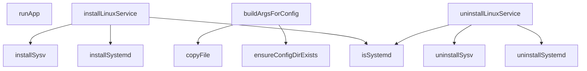

# Behavior Atom: cmd/cloudflared/linux_service.go

## Source Anchor

- Go source: [cloudflare/cloudflared@2026.3.0/cmd/cloudflared/linux_service.go](https://github.com/cloudflare/cloudflared/blob/2026.3.0/cmd/cloudflared/linux_service.go)
- Package: main
- Module group: cmd

## Behavioral Responsibility

CLI command routing and operator-facing behavior surface.

## Entry Points

- No exported/main/init entry point detected; behavior is internal support logic.

## Internal Function Surface

- runApp(app *cli.App, _ chan struct{}) (line 19)
- isSystemd() bool (line 195)
- installLinuxService(c *cli.Context) error (line 202)
- buildArgsForConfig(c *cli.Context, log*zerolog.Logger) ([]string, error) (line 245)
- installSystemd(templateArgs *ServiceTemplateArgs, autoUpdate bool, log*zerolog.Logger) error (line 281)
- installSysv(templateArgs *ServiceTemplateArgs, autoUpdate bool, log*zerolog.Logger) error (line 321)
- uninstallLinuxService(c *cli.Context) error (line 351)
- uninstallSystemd(log *zerolog.Logger) error (line 370)
- uninstallSysv(log *zerolog.Logger) error (line 412)
- ensureConfigDirExists(configDir string) error (line 434)
- copyFile(src string, dest string) error (line 442)

## Input Contract

- CLI flags and command arguments
- func-param:_ chan struct{}
- func-param:app *cli.App
- func-param:autoUpdate bool
- func-param:c *cli.Context
- func-param:configDir string
- func-param:dest string
- func-param:log *zerolog.Logger
- func-param:src string
- func-param:templateArgs *ServiceTemplateArgs

## Output Contract

- filesystem writes
- return:[]string
- return:bool
- return:error
- stdout/stderr or structured logs

## Side Effects and State Transitions

- filesystem I/O
- subprocess execution

## Branching and Failure Semantics

- Branch density: if=40, switch=2, select=0
- error-return paths
- fallback/default branches

## Import and Dependency Surface

- fmt
- github.com/cloudflare/cloudflared/cmd/cloudflared/cliutil
- github.com/cloudflare/cloudflared/cmd/cloudflared/tunnel
- github.com/cloudflare/cloudflared/config
- github.com/cloudflare/cloudflared/logger
- github.com/rs/zerolog
- github.com/urfave/cli/v2
- io
- os

## Go-Impl Flow (Intra-file)

## Rust Porting Notes

- **Systemd unit generation**: `installSystemd()` renders a `.service` unit file template → use `askama` or `format!` for template rendering; write to `/etc/systemd/system/`.
- **Sysv fallback**: Falls back to sysvinit if systemd is unavailable → `#[cfg(target_os = "linux")]` with runtime detection via `std::path::Path::new("/run/systemd/system").exists()`.
- **File operations**: `copyFile()` + permission setting → `std::fs::copy()` + `std::os::unix::fs::PermissionsExt`.
- **Quirk — 40 if-branches + 2 selects**: Heavy platform-specific branching; decompose into `install_systemd()` and `install_sysv()` functions with clear separation.

## Accuracy Notes

- Generated from Go AST parsing and source text pattern extraction.
- Source link is authoritative for disputed semantics; keep this atom synchronized with the linked file.
