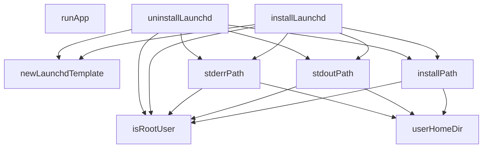

# Behavior Atom: cmd/cloudflared/macos_service.go

## Source Anchor

- Go source: [cloudflare/cloudflared@2026.3.0/cmd/cloudflared/macos_service.go](https://github.com/cloudflare/cloudflared/blob/2026.3.0/cmd/cloudflared/macos_service.go)
- Package: main
- Module group: cmd

## Behavioral Responsibility

CLI command routing and operator-facing behavior surface.

## Entry Points

- No exported/main/init entry point detected; behavior is internal support logic.

## Internal Function Surface

- runApp(app *cli.App, _ chan struct{}) (line 21)
- newLaunchdTemplate(installPath string, stdoutPath string, stderrPath string) *ServiceTemplate (line 41)
- isRootUser() bool (line 75)
- installPath() (string, error) (line 79)
- stdoutPath() (string, error) (line 91)
- stderrPath() (string, error) (line 102)
- installLaunchd(c *cli.Context) error (line 113)
- uninstallLaunchd(c *cli.Context) error (line 173)
- userHomeDir() (string, error) (line 212)

## Input Contract

- CLI flags and command arguments
- func-param:_ chan struct{}
- func-param:app *cli.App
- func-param:c *cli.Context
- func-param:installPath string
- func-param:stderrPath string
- func-param:stdoutPath string

## Output Contract

- return:*ServiceTemplate
- return:bool
- return:error
- return:string
- stdout/stderr or structured logs

## Side Effects and State Transitions

- subprocess execution

## Branching and Failure Semantics

- Branch density: if=23, switch=0, select=0
- error-return paths

## Import and Dependency Surface

- fmt
- github.com/cloudflare/cloudflared/cmd/cloudflared/cliutil
- github.com/cloudflare/cloudflared/logger
- github.com/mitchellh/go-homedir
- github.com/pkg/errors
- github.com/urfave/cli/v2
- os

## Go-Impl Flow (Intra-file)

## Rust Porting Notes

- **Launchd plist generation**: `installLaunchd()` renders a `.plist` XML template → use `plist` crate for structured XML generation, or `askama` template.
- **Home directory resolution**: `go-homedir` with root user check → `dirs::home_dir()` or `std::env::var("HOME")`; root detection via `nix::unistd::getuid().is_root()`.
- **Quirk — 23 if-branches**: Path resolution and permission checks; decompose into `install_path()` and `plist_content()` helpers.

## Accuracy Notes

- Generated from Go AST parsing and source text pattern extraction.
- Source link is authoritative for disputed semantics; keep this atom synchronized with the linked file.
