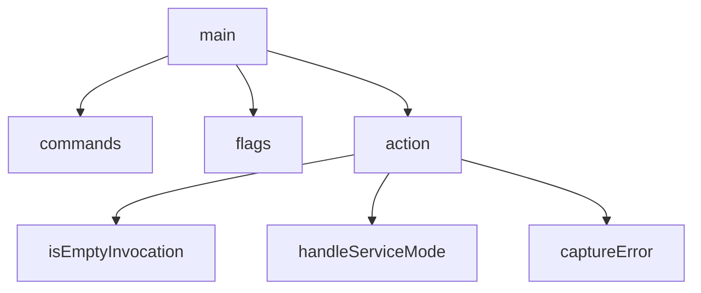

# Behavior Atom: cmd/cloudflared/main.go

## Source Anchor

- Go source: [cloudflare/cloudflared@2026.3.0/cmd/cloudflared/main.go](https://github.com/cloudflare/cloudflared/blob/2026.3.0/cmd/cloudflared/main.go)
- Package: main
- Module group: cmd

## Behavioral Responsibility

CLI command routing and operator-facing behavior surface.

## Entry Points

- main() (line 51)

## Internal Function Surface

- commands(version func(c *cli.Context)) []*cli.Command (line 99)
- flags() []cli.Flag (line 161)
- isEmptyInvocation(c *cli.Context) bool (line 166)
- action(graceShutdownC chan struct{}) cli.ActionFunc (line 170)
- captureError(err error) (line 187)
- handleServiceMode(c *cli.Context, shutdownC chan struct{}) error (line 198)

## Input Contract

- CLI flags and command arguments
- func-param:c *cli.Context
- func-param:err error
- func-param:graceShutdownC chan struct{}
- func-param:shutdownC chan struct{}
- func-param:version func(c *cli.Context)

## Output Contract

- metrics emission
- return:[]*cli.Command
- return:[]cli.Flag
- return:bool
- return:cli.ActionFunc
- return:error
- stdout/stderr or structured logs

## Side Effects and State Transitions

- subprocess execution

## Branching and Failure Semantics

- Branch density: if=8, switch=0, select=0
- error-return paths

## Import and Dependency Surface

- fmt
- github.com/cloudflare/cloudflared/cmd/cloudflared/access
- github.com/cloudflare/cloudflared/cmd/cloudflared/cliutil
- github.com/cloudflare/cloudflared/cmd/cloudflared/flags
- github.com/cloudflare/cloudflared/cmd/cloudflared/management
- github.com/cloudflare/cloudflared/cmd/cloudflared/proxydns
- github.com/cloudflare/cloudflared/cmd/cloudflared/tail
- github.com/cloudflare/cloudflared/cmd/cloudflared/tunnel
- github.com/cloudflare/cloudflared/cmd/cloudflared/updater
- github.com/cloudflare/cloudflared/config
- github.com/cloudflare/cloudflared/logger
- github.com/cloudflare/cloudflared/metrics
- github.com/cloudflare/cloudflared/overwatch
- github.com/cloudflare/cloudflared/token
- github.com/cloudflare/cloudflared/tracing
- github.com/cloudflare/cloudflared/watcher
- github.com/getsentry/sentry-go
- github.com/urfave/cli/v2
- go.uber.org/automaxprocs/maxprocs
- os
- strings
- time

## Go-Impl Flow (Intra-file)

## Accuracy Notes

- Generated from Go AST parsing and source text pattern extraction.
- Source link is authoritative for disputed semantics; keep this atom synchronized with the linked file.

## Rust Porting Notes

- **CLI entrypoint**: `urfave/cli/v2` app builder → `clap::Command` with `#[derive(Parser)]` or manual `Command::new` builder.
- **Sentry init**: `sentry-go.Init` with DSN and release tag → `sentry::init(sentry::ClientOptions { dsn: ..., release: ... })`; guard the return value for flush-on-drop.
- **Automaxprocs**: `go.uber.org/automaxprocs` for GOMAXPROCS → unnecessary in Rust; tokio's work-stealing runtime auto-scales to available cores.
- **Logger setup**: `logger` package init → `tracing_subscriber::fmt::init()` with `EnvFilter` for level control.
- **Overwatch/watcher**: `overwatch.NewAppManager` + `watcher.NewFile` → `notify` crate for file watching; overwatch pattern may simplify to config reload via `tokio::sync::watch`.
- **Token cleanup**: `token.CleanupStaleTokens` deferred → call in `main` with `tokio::task::spawn_blocking` if it does filesystem I/O.
- **Quirk — subprocess execution**: Side effect metadata reports subprocess execution via the `updater` / `proxydns` subcommands — isolate behind feature flags in the Rust binary.
