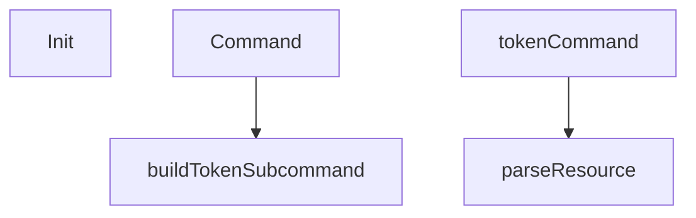

# Behavior Atom: cmd/cloudflared/management/cmd.go

## Source Anchor

- Go source: [cloudflare/cloudflared@2026.3.0/cmd/cloudflared/management/cmd.go](https://github.com/cloudflare/cloudflared/blob/2026.3.0/cmd/cloudflared/management/cmd.go)
- Package: management
- Module group: cmd

## Behavioral Responsibility

CLI command routing and operator-facing behavior surface.

## Entry Points

- Init(bi *cliutil.BuildInfo) (line 19)
- Command() *cli.Command (line 24)

## Internal Function Surface

- buildTokenSubcommand() *cli.Command (line 37)
- tokenCommand(c *cli.Context) error (line 69)
- parseResource(resource string) (cfapi.ManagementResource, error) (line 94)

## Input Contract

- CLI flags and command arguments
- func-param:bi *cliutil.BuildInfo
- func-param:c *cli.Context
- func-param:resource string

## Output Contract

- return:*cli.Command
- return:cfapi.ManagementResource
- return:error

## Side Effects and State Transitions

- subprocess execution

## Branching and Failure Semantics

- Branch density: if=2, switch=1, select=0
- error-return paths
- fallback/default branches

## Import and Dependency Surface

- encoding/json
- fmt
- github.com/cloudflare/cloudflared/cfapi
- github.com/cloudflare/cloudflared/cmd/cloudflared/cliutil
- github.com/cloudflare/cloudflared/cmd/cloudflared/flags
- github.com/cloudflare/cloudflared/credentials
- github.com/urfave/cli/v2
- os

## Go-Impl Flow (Intra-file)

## Rust Porting Notes

- **Command builder**: `Command()` / `tokenCommand()` → `clap::Command` with subcommands.
- **Resource parsing**: `parseResource()` with `switch` on resource type → `match` on a `ResourceType` enum.
- **Quirk — select with 1 branch**: Likely a context-cancellation select; translate to `tokio::select!` with cancellation token.

## Accuracy Notes

- Generated from Go AST parsing and source text pattern extraction.
- Source link is authoritative for disputed semantics; keep this atom synchronized with the linked file.
