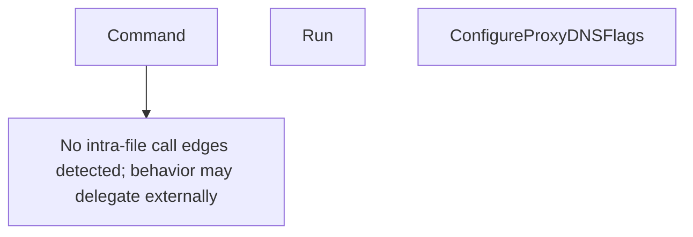

# Behavior Atom: cmd/cloudflared/proxydns/cmd.go

## Source Anchor

- Go source: [cloudflare/cloudflared@2026.3.0/cmd/cloudflared/proxydns/cmd.go](https://github.com/cloudflare/cloudflared/blob/2026.3.0/cmd/cloudflared/proxydns/cmd.go)
- Package: proxydns
- Module group: cmd

## Behavioral Responsibility

CLI command routing and operator-facing behavior surface.

## Entry Points

- Command() *cli.Command (line 15)
- Run(c *cli.Context) error (line 24)
- ConfigureProxyDNSFlags(shouldHide bool) []cli.Flag (line 33)

## Internal Function Surface

- None detected.

## Input Contract

- CLI flags and command arguments
- func-param:c *cli.Context
- func-param:shouldHide bool

## Output Contract

- return:*cli.Command
- return:[]cli.Flag
- return:error
- stdout/stderr or structured logs

## Side Effects and State Transitions

- subprocess execution

## Branching and Failure Semantics

- Branch density: if=0, switch=0, select=0
- error-return paths

## Import and Dependency Surface

- errors
- github.com/cloudflare/cloudflared/cmd/cloudflared/cliutil
- github.com/cloudflare/cloudflared/logger
- github.com/urfave/cli/v2
- github.com/urfave/cli/v2/altsrc

## Go-Impl Flow (Intra-file)

## Rust Porting Notes

- **DNS proxy command**: `Command()` + `Run()` wrappers → `clap::Command` + async handler; DNS resolution via `trust-dns-resolver` or `hickory-resolver`.
- **Quirk — zero branching**: Thin command wrapper; direct port.

## Accuracy Notes

- Generated from Go AST parsing and source text pattern extraction.
- Source link is authoritative for disputed semantics; keep this atom synchronized with the linked file.
