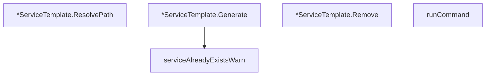

# Behavior Atom: cmd/cloudflared/service_template.go

## Source Anchor

- Go source: [cloudflare/cloudflared@2026.3.0/cmd/cloudflared/service_template.go](https://github.com/cloudflare/cloudflared/blob/2026.3.0/cmd/cloudflared/service_template.go)
- Package: main
- Module group: cmd

## Behavioral Responsibility

CLI command routing and operator-facing behavior surface.

## Entry Points

- (*ServiceTemplate) ResolvePath() (string, error) (line 27)
- (*ServiceTemplate) Generate(args*ServiceTemplateArgs) error (line 35)
- (*ServiceTemplate) Remove() error (line 71)

## Internal Function Surface

- serviceAlreadyExistsWarn(service string) string (line 83)
- runCommand(command string, args ...string) error (line 92)

## Input Contract

- func-param:args *ServiceTemplateArgs
- func-param:args ...string
- func-param:command string
- func-param:service string

## Output Contract

- filesystem writes
- return:error
- return:string

## Side Effects and State Transitions

- filesystem I/O
- subprocess execution

## Branching and Failure Semantics

- Branch density: if=13, switch=0, select=0
- error-return paths

## Import and Dependency Surface

- bytes
- errors
- fmt
- github.com/mitchellh/go-homedir
- io
- os
- os/exec
- path/filepath
- text/template

## Go-Impl Flow (Intra-file)

## Rust Porting Notes

- **Template rendering**: `Generate()` uses `text/template` → `askama` or `tera` crate for template expansion with type-safe variables.
- **Subprocess execution**: `runCommand()` shells out for service control → `tokio::process::Command::new("systemctl").args(&["enable", name]).status().await`.
- **File path resolution**: `ResolvePath()` with `~` expansion → `dirs::home_dir()` + `PathBuf::join()`.
- **Quirk — 13 if-branches**: Error checks around template render + file write + exec; chain with `?`.

## Accuracy Notes

- Generated from Go AST parsing and source text pattern extraction.
- Source link is authoritative for disputed semantics; keep this atom synchronized with the linked file.
