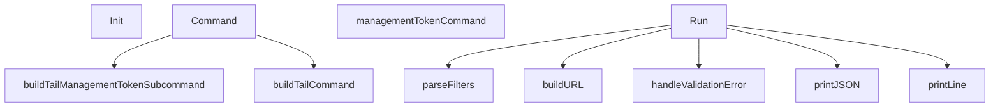

# Behavior Atom: cmd/cloudflared/tail/cmd.go

## Source Anchor

- Go source: [cloudflare/cloudflared@2026.3.0/cmd/cloudflared/tail/cmd.go](https://github.com/cloudflare/cloudflared/blob/2026.3.0/cmd/cloudflared/tail/cmd.go)
- Package: tail
- Module group: cmd

## Behavioral Responsibility

CLI command routing and operator-facing behavior surface.

## Entry Points

- Init(bi *cliutil.BuildInfo) (line 28)
- Command() *cli.Command (line 32)
- Run(c *cli.Context) error (line 263)

## Internal Function Surface

- buildTailManagementTokenSubcommand() *cli.Command (line 40)
- managementTokenCommand(c *cli.Context) error (line 51)
- buildTailCommand(subcommands []*cli.Command)*cli.Command (line 65)
- handleValidationError(resp *http.Response, log*zerolog.Logger) (line 144)
- parseFilters(c *cli.Context) (*management.StreamingFilters, error) (line 164)
- buildURL(c *cli.Context, log*zerolog.Logger, res cfapi.ManagementResource) (url.URL, error) (line 208)
- printLine(log *management.Log, logger*zerolog.Logger) (line 244)
- printJSON(log *management.Log, logger*zerolog.Logger) (line 253)

## Input Contract

- CLI flags and command arguments
- OS signals
- func-param:bi *cliutil.BuildInfo
- func-param:c *cli.Context
- func-param:log *management.Log
- func-param:log *zerolog.Logger
- func-param:logger *zerolog.Logger
- func-param:res cfapi.ManagementResource
- func-param:resp *http.Response
- func-param:subcommands []*cli.Command

## Output Contract

- return:*cli.Command
- return:*management.StreamingFilters
- return:error
- return:url.URL
- stdout/stderr or structured logs

## Side Effects and State Transitions

- network I/O
- subprocess execution
- concurrency primitives
- timers and scheduling
- signal handling

## Branching and Failure Semantics

- Branch density: if=28, switch=2, select=3
- error-return paths
- fallback/default branches

## Import and Dependency Surface

- encoding/json
- errors
- fmt
- github.com/cloudflare/cloudflared/cfapi
- github.com/cloudflare/cloudflared/cmd/cloudflared/cliutil
- github.com/cloudflare/cloudflared/cmd/cloudflared/flags
- github.com/cloudflare/cloudflared/credentials
- github.com/cloudflare/cloudflared/management
- github.com/google/uuid
- github.com/rs/zerolog
- github.com/urfave/cli/v2
- net/http
- net/url
- nhooyr.io/websocket
- os
- os/signal
- syscall
- time

## Go-Impl Flow (Intra-file)

## Rust Porting Notes

- **WebSocket streaming**: `Run()` opens WS connection and streams log lines with `select` for signals → `tokio_tungstenite` for WS + `tokio::select!` over message stream and `ctrl_c()` / cancellation.
- **Filter parsing**: `parseFilters()` builds log filter predicates → typed filter enum with `matches(&LogLine) -> bool` method.
- **Signal-aware select**: 3 `select` blocks for concurrent WS read + signal handling → consolidate into single `tokio::select!` with proper cancellation safety.
- **Quirk — 28 if-branches**: Validation + output formatting; decompose into `parse_args()`, `connect()`, and `stream_logs()` functions.

## Accuracy Notes

- Generated from Go AST parsing and source text pattern extraction.
- Source link is authoritative for disputed semantics; keep this atom synchronized with the linked file.
