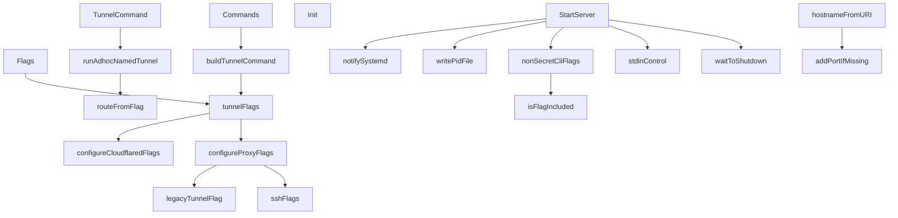

# Behavior Atom: cmd/cloudflared/tunnel/cmd.go

## Source Anchor

- Go source: [cloudflare/cloudflared@2026.3.0/cmd/cloudflared/tunnel/cmd.go](https://github.com/cloudflare/cloudflared/blob/2026.3.0/cmd/cloudflared/tunnel/cmd.go)
- Package: tunnel
- Module group: cmd

## Behavioral Responsibility

CLI command routing and operator-facing behavior surface.

## Entry Points

- Flags() []cli.Flag (line 158)
- Commands() []*cli.Command (line 162)
- TunnelCommand(c *cli.Context) error (line 227)
- Init(info *cliutil.BuildInfo, gracefulShutdown chan struct{}) (line 271)
- StartServer(c *cli.Context, info*cliutil.BuildInfo, namedTunnel *connection.TunnelProperties, log*zerolog.Logger) error (line 313)

## Internal Function Surface

- buildTunnelCommand(subcommands []*cli.Command)*cli.Command (line 189)
- runAdhocNamedTunnel(sc *subcommandContext, name string, credentialsOutputPath string) error (line 276)
- routeFromFlag(c *cli.Context) (route cfapi.HostnameRoute, ok bool) (line 303)
- waitToShutdown(wg *sync.WaitGroup, cancelServerContext func(), errC <-chan error, graceShutdownC <-chan struct{}, gracePeriod time.Duration, log*zerolog.Logger) error (line 512)
- notifySystemd(waitForSignal *signal.Signal) (line 556)
- writePidFile(waitForSignal *signal.Signal, pidPathname string, log*zerolog.Logger) (line 561)
- hostnameFromURI(uri string) string (line 577)
- addPortIfMissing(uri *url.URL, port int) string (line 595)
- tunnelFlags(shouldHide bool) []cli.Flag (line 602)
- configureCloudflaredFlags(shouldHide bool) []cli.Flag (line 852)
- configureProxyFlags(shouldHide bool) []cli.Flag (line 902)
- legacyTunnelFlag(msg string) string (line 1033)
- sshFlags(shouldHide bool) []cli.Flag (line 1042)
- stdinControl(reconnectCh chan supervisor.ReconnectSignal, log *zerolog.Logger) (line 1137)
- nonSecretCliFlags(log *zerolog.Logger, cli*cli.Context, flagInclusionList []string) map[string]string (line 1170)
- isFlagIncluded(flagInclusionList []string, flag string) bool (line 1203)

## Input Contract

- CLI flags and command arguments
- func-param:c *cli.Context
- func-param:cancelServerContext func()
- func-param:cli *cli.Context
- func-param:credentialsOutputPath string
- func-param:errC <-chan error
- func-param:flag string
- func-param:flagInclusionList []string
- func-param:gracePeriod time.Duration
- func-param:graceShutdownC <-chan struct{}
- func-param:gracefulShutdown chan struct{}
- func-param:info *cliutil.BuildInfo
- func-param:log *zerolog.Logger
- func-param:msg string
- func-param:name string
- func-param:namedTunnel *connection.TunnelProperties
- func-param:pidPathname string
- func-param:port int
- func-param:reconnectCh chan supervisor.ReconnectSignal
- func-param:sc *subcommandContext
- func-param:shouldHide bool
- func-param:subcommands []*cli.Command
- func-param:uri *url.URL
- func-param:uri string
- func-param:waitForSignal *signal.Signal
- func-param:wg *sync.WaitGroup
- stdin

## Output Contract

- filesystem writes
- metrics emission
- return:*cli.Command
- return:[]*cli.Command
- return:[]cli.Flag
- return:bool
- return:error
- return:map[string]string
- return:ok bool
- return:route cfapi.HostnameRoute
- return:string
- stdout/stderr or structured logs

## Side Effects and State Transitions

- network I/O
- filesystem I/O
- subprocess execution
- concurrency primitives
- timers and scheduling

## Branching and Failure Semantics

- Branch density: if=46, switch=3, select=3
- error-return paths
- fallback/default branches

## Import and Dependency Surface

- bufio
- context
- fmt
- github.com/cloudflare/cloudflared/cfapi
- github.com/cloudflare/cloudflared/cmd/cloudflared/cliutil
- github.com/cloudflare/cloudflared/cmd/cloudflared/flags
- github.com/cloudflare/cloudflared/cmd/cloudflared/proxydns
- github.com/cloudflare/cloudflared/cmd/cloudflared/updater
- github.com/cloudflare/cloudflared/config
- github.com/cloudflare/cloudflared/connection
- github.com/cloudflare/cloudflared/credentials
- github.com/cloudflare/cloudflared/diagnostic
- github.com/cloudflare/cloudflared/edgediscovery
- github.com/cloudflare/cloudflared/ingress
- github.com/cloudflare/cloudflared/logger
- github.com/cloudflare/cloudflared/management
- github.com/cloudflare/cloudflared/metrics
- github.com/cloudflare/cloudflared/orchestration
- github.com/cloudflare/cloudflared/signal
- github.com/cloudflare/cloudflared/supervisor
- github.com/cloudflare/cloudflared/tlsconfig
- github.com/cloudflare/cloudflared/tunnelstate
- github.com/cloudflare/cloudflared/validation
- github.com/coreos/go-systemd/v22/daemon
- github.com/facebookgo/grace/gracenet
- github.com/getsentry/sentry-go
- github.com/mitchellh/go-homedir
- github.com/pkg/errors
- github.com/rs/zerolog
- github.com/urfave/cli/v2
- github.com/urfave/cli/v2/altsrc
- net/url
- os
- path/filepath
- runtime/trace
- strings
- sync
- time

## Go-Impl Flow (Intra-file)

## Accuracy Notes

- Generated from Go AST parsing and source text pattern extraction.
- Source link is authoritative for disputed semantics; keep this atom synchronized with the linked file.

## Rust Porting Notes

- **CLI framework**: `urfave/cli/v2` commands and flags → `clap` derive macros with `#[command(subcommand)]` enums. The 1000+ line flag definition block becomes declarative struct annotations.
- **Shutdown coordination**: `sync.WaitGroup` + `<-chan error` + `<-chan struct{}` in `waitToShutdown` → `tokio::task::JoinSet` or structured `tokio::select!` on mpsc receivers.
- **Systemd notification**: `go-systemd/v22/daemon.SdNotify` → `sd-notify` crate (`notify(false, &[NotifyState::Ready])`).
- **PID file**: `writePidFile` → `std::fs::write` with a `Drop` guard for cleanup on shutdown.
- **Stdin control**: `stdinControl` goroutine reading from stdin → `tokio::io::BufReader::new(tokio::io::stdin())` with line-based command parsing.
- **Reconnect channel**: `chan supervisor.ReconnectSignal` → `tokio::sync::mpsc::Sender<ReconnectSignal>`.
- **Home directory**: `go-homedir` → `dirs::home_dir()` crate.
- **Graceful listener**: `grace/gracenet` FD-passing → `listenfd` crate or manual `FromRawFd` on systemd-passed sockets.
- **Sentry integration**: `sentry-go` → `sentry` crate with `sentry::capture_error`.
- **Quirk — adhoc named tunnel**: `runAdhocNamedTunnel` creates a tunnel via API then starts serving — in Rust, split into an async provisioning step and a serve step to avoid mixing I/O concerns.
