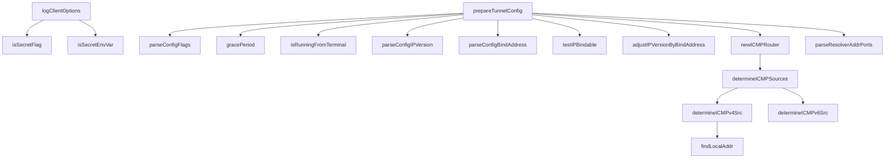

# Behavior Atom: cmd/cloudflared/tunnel/configuration.go

## Source Anchor

- Go source: [cloudflare/cloudflared@2026.3.0/cmd/cloudflared/tunnel/configuration.go](https://github.com/cloudflare/cloudflared/blob/2026.3.0/cmd/cloudflared/tunnel/configuration.go)
- Package: tunnel
- Module group: cmd

## Behavioral Responsibility

CLI command routing and operator-facing behavior surface.

## Entry Points

- No exported/main/init entry point detected; behavior is internal support logic.

## Internal Function Surface

- logClientOptions(c *cli.Context, log*zerolog.Logger) (line 60)
- isSecretFlag(key string) bool (line 94)
- isSecretEnvVar(key string) bool (line 103)
- prepareTunnelConfig(ctx context.Context, c *cli.Context, info*cliutil.BuildInfo, log *zerolog.Logger, logTransport*zerolog.Logger, observer *connection.Observer, namedTunnel*connection.TunnelProperties) (*supervisor.TunnelConfig,*orchestration.Config, error) (line 114)
- parseConfigFlags(c *cli.Context) map[string]string (line 282)
- gracePeriod(c *cli.Context) (time.Duration, error) (line 294)
- isRunningFromTerminal() bool (line 302)
- parseConfigIPVersion(version string) (v allregions.ConfigIPVersion, err error) (line 307)
- parseConfigBindAddress(ipstr string) (net.IP, error) (line 321)
- testIPBindable(ip net.IP) error (line 333)
- adjustIPVersionByBindAddress(ipVersion allregions.ConfigIPVersion, ip net.IP) (allregions.ConfigIPVersion, error) (line 348)
- newICMPRouter(c *cli.Context, logger*zerolog.Logger) (ingress.ICMPRouterServer, error) (line 366)
- determineICMPSources(c *cli.Context, logger*zerolog.Logger) (netip.Addr, netip.Addr, error) (line 379)
- determineICMPv4Src(userDefinedSrc string, logger *zerolog.Logger) (netip.Addr, error) (line 401)
- determineICMPv6Src(userDefinedSrc string, logger *zerolog.Logger, ipv4Src netip.Addr) (addr netip.Addr, zone string, err error) (line 426)
- findLocalAddr(dst net.IP, port int) (netip.Addr, error) (line 498)
- parseResolverAddrPorts(input []string) ([]netip.AddrPort, error) (line 515)

## Input Contract

- CLI flags and command arguments
- environment variables
- func-param:c *cli.Context
- func-param:ctx context.Context
- func-param:dst net.IP
- func-param:info *cliutil.BuildInfo
- func-param:input []string
- func-param:ip net.IP
- func-param:ipVersion allregions.ConfigIPVersion
- func-param:ipstr string
- func-param:ipv4Src netip.Addr
- func-param:key string
- func-param:log *zerolog.Logger
- func-param:logTransport *zerolog.Logger
- func-param:logger *zerolog.Logger
- func-param:namedTunnel *connection.TunnelProperties
- func-param:observer *connection.Observer
- func-param:port int
- func-param:userDefinedSrc string
- func-param:version string

## Output Contract

- metrics emission
- return:*orchestration.Config
- return:*supervisor.TunnelConfig
- return:[]netip.AddrPort
- return:addr netip.Addr
- return:allregions.ConfigIPVersion
- return:bool
- return:err error
- return:error
- return:ingress.ICMPRouterServer
- return:map[string]string
- return:net.IP
- return:netip.Addr
- return:time.Duration
- return:v allregions.ConfigIPVersion
- return:zone string
- stdout/stderr or structured logs

## Side Effects and State Transitions

- network I/O

## Branching and Failure Semantics

- Branch density: if=65, switch=1, select=0
- error-return paths
- fallback/default branches

## Import and Dependency Surface

- context
- crypto/tls
- fmt
- github.com/cloudflare/cloudflared/client
- github.com/cloudflare/cloudflared/cmd/cloudflared/cliutil
- github.com/cloudflare/cloudflared/cmd/cloudflared/flags
- github.com/cloudflare/cloudflared/config
- github.com/cloudflare/cloudflared/connection
- github.com/cloudflare/cloudflared/edgediscovery
- github.com/cloudflare/cloudflared/edgediscovery/allregions
- github.com/cloudflare/cloudflared/features
- github.com/cloudflare/cloudflared/ingress
- github.com/cloudflare/cloudflared/ingress/origins
- github.com/cloudflare/cloudflared/orchestration
- github.com/cloudflare/cloudflared/supervisor
- github.com/cloudflare/cloudflared/tlsconfig
- github.com/cloudflare/cloudflared/tunnelrpc/pogs
- github.com/pkg/errors
- github.com/prometheus/client_golang/prometheus
- github.com/rs/zerolog
- github.com/urfave/cli/v2
- github.com/urfave/cli/v2/altsrc
- golang.org/x/term
- net
- net/netip
- os
- strings
- time

## Go-Impl Flow (Intra-file)

## Accuracy Notes

- Generated from Go AST parsing and source text pattern extraction.
- Source link is authoritative for disputed semantics; keep this atom synchronized with the linked file.

## Rust Porting Notes

- **CLI framework**: Replace `urfave/cli/v2` `*cli.Context` bag-of-values API with `clap` derive macros producing typed config structs. Each `c.String("flag")` / `c.Bool("flag")` call becomes a typed struct field.
- **Flag-set detection**: `c.IsSet(flag)` has no direct `clap` equivalent — use `ArgMatches::value_source()` to distinguish CLI-provided vs default values.
- **Secret filtering**: `isSecretFlag`/`isSecretEnvVar` string-matching → annotate sensitive fields with a custom attribute or wrapper type that implements `Debug` without revealing values.
- **IP binding**: `net.IP` / `netip.Addr` → `std::net::IpAddr` / `std::net::SocketAddr`. `testIPBindable` UDP dial probe → `socket2::Socket` bind check.
- **ICMP router**: `newICMPRouter` raw socket setup → `socket2` or `pnet` crate for raw ICMP; platform-conditional compilation via `#[cfg(target_os)]`.
- **Error wrapping**: `github.com/pkg/errors` `Wrap`/`Cause` → `thiserror` for typed errors or `anyhow::Context` for ad-hoc wrapping.
- **Duration parsing**: `gracePeriod` CLI duration → `humantime` crate or `std::time::Duration` with custom parser.
- **Quirk — 65 if-branches**: The dense conditional logic in `prepareTunnelConfig` should be decomposed into smaller builder methods in Rust to stay within cognitive-load limits.
