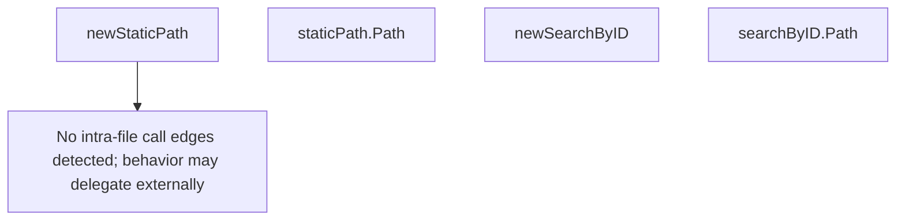

# Behavior Atom: cmd/cloudflared/tunnel/credential_finder.go

## Source Anchor

- Go source: [cloudflare/cloudflared@2026.3.0/cmd/cloudflared/tunnel/credential_finder.go](https://github.com/cloudflare/cloudflared/blob/2026.3.0/cmd/cloudflared/tunnel/credential_finder.go)
- Package: tunnel
- Module group: cmd

## Behavioral Responsibility

CLI command routing and operator-facing behavior surface.

## Entry Points

- (staticPath) Path() (string, error) (line 35)
- (searchByID) Path() (string, error) (line 60)

## Internal Function Surface

- newStaticPath(filePath string, fs fileSystem) CredFinder (line 28)
- newSearchByID(id uuid.UUID, c *cli.Context, log*zerolog.Logger, fs fileSystem) CredFinder (line 51)

## Input Contract

- CLI flags and command arguments
- func-param:c *cli.Context
- func-param:filePath string
- func-param:fs fileSystem
- func-param:id uuid.UUID
- func-param:log *zerolog.Logger

## Output Contract

- return:CredFinder
- return:error
- return:string
- stdout/stderr or structured logs

## Side Effects and State Transitions

- No high-signal side effect pattern detected in static scan.

## Branching and Failure Semantics

- Branch density: if=7, switch=0, select=0
- error-return paths

## Import and Dependency Surface

- fmt
- github.com/cloudflare/cloudflared/cmd/cloudflared/flags
- github.com/cloudflare/cloudflared/config
- github.com/cloudflare/cloudflared/credentials
- github.com/google/uuid
- github.com/rs/zerolog
- github.com/urfave/cli/v2
- path/filepath

## Go-Impl Flow (Intra-file)

## Rust Porting Notes

- **CredFinder interface**: Dual implementations (static path vs search-by-ID) → `enum CredentialFinder { StaticPath(PathBuf), SearchById(Uuid) }` with a `find(&self) -> Result<Credentials>` method.
- **Closure-like capture**: Implementations capture config context → struct fields hold the captured state.
- **Quirk — 7 if-branches**: Path/ID validation; use `?` operator.

## Accuracy Notes

- Generated from Go AST parsing and source text pattern extraction.
- Source link is authoritative for disputed semantics; keep this atom synchronized with the linked file.
