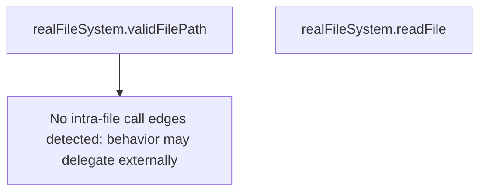

# Behavior Atom: cmd/cloudflared/tunnel/filesystem.go

## Source Anchor

- Go source: [cloudflare/cloudflared@2026.3.0/cmd/cloudflared/tunnel/filesystem.go](https://github.com/cloudflare/cloudflared/blob/2026.3.0/cmd/cloudflared/tunnel/filesystem.go)
- Package: tunnel
- Module group: cmd

## Behavioral Responsibility

CLI command routing and operator-facing behavior surface.

## Entry Points

- No exported/main/init entry point detected; behavior is internal support logic.

## Internal Function Surface

- (realFileSystem) validFilePath(path string) bool (line 16)
- (realFileSystem) readFile(filePath string) ([]byte, error) (line 24)

## Input Contract

- func-param:filePath string
- func-param:path string

## Output Contract

- return:[]byte
- return:bool
- return:error

## Side Effects and State Transitions

- filesystem I/O

## Branching and Failure Semantics

- Branch density: if=1, switch=0, select=0
- error-return paths

## Import and Dependency Surface

- os

## Go-Impl Flow (Intra-file)

## Rust Porting Notes

- **File path validation**: `validFilePath()` → `std::path::Path::try_exists()` or `metadata()` check.
- **File reading**: `readFile()` → `std::fs::read_to_string()` or `tokio::fs::read_to_string()`.
- **Quirk — trivial**: Only 1 if-branch; direct translation.

## Accuracy Notes

- Generated from Go AST parsing and source text pattern extraction.
- Source link is authoritative for disputed semantics; keep this atom synchronized with the linked file.
