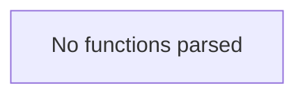

# Behavior Atom: cmd/cloudflared/tunnel/info.go

## Source Anchor

- Go source: [cloudflare/cloudflared@2026.3.0/cmd/cloudflared/tunnel/info.go](https://github.com/cloudflare/cloudflared/blob/2026.3.0/cmd/cloudflared/tunnel/info.go)
- Package: tunnel
- Module group: cmd

## Behavioral Responsibility

CLI command routing and operator-facing behavior surface.

## Entry Points

- No exported/main/init entry point detected; behavior is internal support logic.

## Internal Function Surface

- None detected.

## Input Contract

- Inputs are indirect through callers; no direct input pattern detected statically.

## Output Contract

- Output is primarily side-effect based; no explicit return/output pattern detected statically.

## Side Effects and State Transitions

- No high-signal side effect pattern detected in static scan.

## Branching and Failure Semantics

- Branch density: if=0, switch=0, select=0
- No explicit failure pattern markers found in static scan.

## Import and Dependency Surface

- github.com/cloudflare/cloudflared/cfapi
- github.com/google/uuid
- time

## Go-Impl Flow (Intra-file)

## Rust Porting Notes

- **Type definitions**: Tunnel metadata structs aggregating API types → Rust `struct TunnelInfo { id: Uuid, name: String, created_at: DateTime<Utc>, ... }` with `serde::Deserialize`.
- **Quirk — no logic**: Pure type/constant file; direct `struct` translation.

## Accuracy Notes

- Generated from Go AST parsing and source text pattern extraction.
- Source link is authoritative for disputed semantics; keep this atom synchronized with the linked file.
