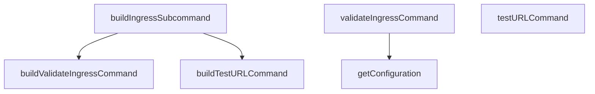

# Behavior Atom: cmd/cloudflared/tunnel/ingress_subcommands.go

## Source Anchor

- Go source: [cloudflare/cloudflared@2026.3.0/cmd/cloudflared/tunnel/ingress_subcommands.go](https://github.com/cloudflare/cloudflared/blob/2026.3.0/cmd/cloudflared/tunnel/ingress_subcommands.go)
- Package: tunnel
- Module group: cmd

## Behavioral Responsibility

CLI command routing and operator-facing behavior surface.

## Entry Points

- No exported/main/init entry point detected; behavior is internal support logic.

## Internal Function Surface

- buildIngressSubcommand() *cli.Command (line 25)
- buildValidateIngressCommand() *cli.Command (line 55)
- buildTestURLCommand() *cli.Command (line 66)
- validateIngressCommand(c *cli.Context, warnings string) error (line 82)
- getConfiguration(c *cli.Context) (*config.Configuration, error) (line 103)
- testURLCommand(c *cli.Context) error (line 120)

## Input Contract

- CLI flags and command arguments
- func-param:c *cli.Context
- func-param:warnings string
- serialized configuration payloads

## Output Contract

- return:*cli.Command
- return:*config.Configuration
- return:error
- stdout/stderr or structured logs

## Side Effects and State Transitions

- subprocess execution

## Branching and Failure Semantics

- Branch density: if=10, switch=0, select=0
- error-return paths

## Import and Dependency Surface

- encoding/json
- fmt
- github.com/cloudflare/cloudflared/cmd/cloudflared/cliutil
- github.com/cloudflare/cloudflared/config
- github.com/cloudflare/cloudflared/ingress
- github.com/pkg/errors
- github.com/urfave/cli/v2
- net/url

## Go-Impl Flow (Intra-file)

## Rust Porting Notes

- **Ingress validation CLI**: `validateIngressCommand()` loads config and validates ingress rules → async function parsing YAML config via `serde_yaml` and validating against ingress rule schema.
- **Config loading**: `getConfiguration()` loads from file → `config::Config` crate or direct YAML parsing.
- **Quirk — 10 if-branches**: Validation logic; decompose into `load_config()` and `validate_rules()` steps.

## Accuracy Notes

- Generated from Go AST parsing and source text pattern extraction.
- Source link is authoritative for disputed semantics; keep this atom synchronized with the linked file.
