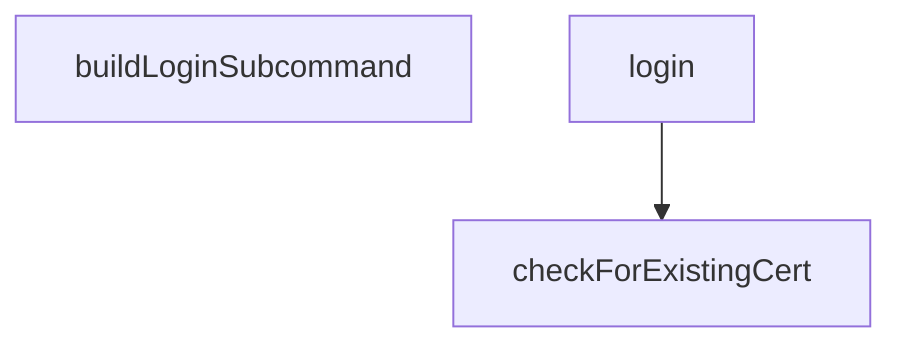

# Behavior Atom: cmd/cloudflared/tunnel/login.go

## Source Anchor

- Go source: [cloudflare/cloudflared@2026.3.0/cmd/cloudflared/tunnel/login.go](https://github.com/cloudflare/cloudflared/blob/2026.3.0/cmd/cloudflared/tunnel/login.go)
- Package: tunnel
- Module group: cmd

## Behavioral Responsibility

CLI command routing and operator-facing behavior surface.

## Entry Points

- No exported/main/init entry point detected; behavior is internal support logic.

## Internal Function Surface

- buildLoginSubcommand(hidden bool) *cli.Command (line 50)
- login(c *cli.Context) error (line 65)
- checkForExistingCert() (string, bool, error) (line 133)

## Input Contract

- CLI flags and command arguments
- func-param:c *cli.Context
- func-param:hidden bool

## Output Contract

- filesystem writes
- return:*cli.Command
- return:bool
- return:error
- return:string
- stdout/stderr or structured logs

## Side Effects and State Transitions

- filesystem I/O
- subprocess execution

## Branching and Failure Semantics

- Branch density: if=14, switch=0, select=0
- error-return paths

## Import and Dependency Surface

- fmt
- github.com/cloudflare/cloudflared/cmd/cloudflared/cliutil
- github.com/cloudflare/cloudflared/cmd/cloudflared/flags
- github.com/cloudflare/cloudflared/config
- github.com/cloudflare/cloudflared/credentials
- github.com/cloudflare/cloudflared/logger
- github.com/cloudflare/cloudflared/token
- github.com/mitchellh/go-homedir
- github.com/pkg/errors
- github.com/urfave/cli/v2
- net/url
- os
- path/filepath
- syscall

## Go-Impl Flow (Intra-file)

## Rust Porting Notes

- **OAuth browser flow**: `login()` launches browser for auth + polls for certificate → `open::that(url)` for browser launch; callback via local HTTP server (`hyper`) or polling loop.
- **Certificate file check**: `checkForExistingCert()` → `Path::try_exists()` with user prompt via `dialoguer` or stdin.
- **Quirk — 14 if-branches**: Auth flow branching with fallbacks; decompose into `try_browser_auth()` and `try_manual_auth()` paths.

## Accuracy Notes

- Generated from Go AST parsing and source text pattern extraction.
- Source link is authoritative for disputed semantics; keep this atom synchronized with the linked file.
