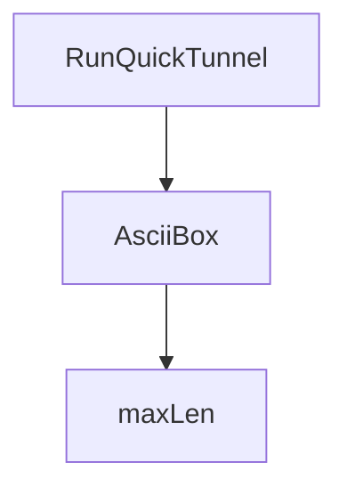

# Behavior Atom: cmd/cloudflared/tunnel/quick_tunnel.go

## Source Anchor

- Go source: [cloudflare/cloudflared@2026.3.0/cmd/cloudflared/tunnel/quick_tunnel.go](https://github.com/cloudflare/cloudflared/blob/2026.3.0/cmd/cloudflared/tunnel/quick_tunnel.go)
- Package: tunnel
- Module group: cmd

## Behavioral Responsibility

CLI command routing and operator-facing behavior surface.

## Entry Points

- RunQuickTunnel(sc *subcommandContext) error (line 25)
- AsciiBox(lines []string, padding int) box []string (line 121)

## Internal Function Surface

- maxLen(lines []string) int (line 133)

## Input Contract

- func-param:lines []string
- func-param:padding int
- func-param:sc *subcommandContext
- serialized configuration payloads

## Output Contract

- return:box []string
- return:error
- return:int
- stdout/stderr or structured logs

## Side Effects and State Transitions

- network I/O

## Branching and Failure Semantics

- Branch density: if=8, switch=0, select=0
- error-return paths

## Import and Dependency Surface

- encoding/json
- fmt
- github.com/cloudflare/cloudflared/cmd/cloudflared/flags
- github.com/cloudflare/cloudflared/connection
- github.com/google/uuid
- github.com/pkg/errors
- io
- net/http
- strings
- time

## Go-Impl Flow (Intra-file)

## Accuracy Notes

- Generated from Go AST parsing and source text pattern extraction.
- Source link is authoritative for disputed semantics; keep this atom synchronized with the linked file.

## Rust Porting Notes

- **Quick tunnel API**: HTTP POST to Cloudflare API for ephemeral tunnel provisioning → `reqwest::Client::post` with `serde_json` serialization of the response.
- **UUID tunnel ID**: `google/uuid` for tunnel ID parsing from API response → `uuid::Uuid::parse_str`.
- **ASCII box formatter**: `AsciiBox` helper for CLI banner output → simple string formatting; consider `dialoguer` or manual `println!` with padding.
- **Connection properties**: Constructs `connection.TunnelProperties` from API response → typed struct construction with builder pattern.
- **Quirk — 8 if-branches**: Light branching for error handling around API call and response parsing — model as `?` chains in Rust for clean error propagation.
- **Quirk — hardcoded API endpoint**: Quick tunnel URL is hardcoded → extract as a const in Rust for testability and environment override.
