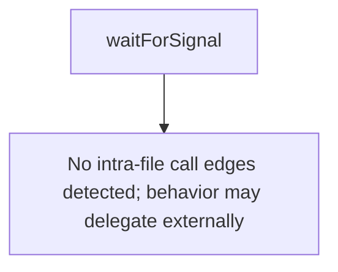

# Behavior Atom: cmd/cloudflared/tunnel/signal.go

## Source Anchor

- Go source: [cloudflare/cloudflared@2026.3.0/cmd/cloudflared/tunnel/signal.go](https://github.com/cloudflare/cloudflared/blob/2026.3.0/cmd/cloudflared/tunnel/signal.go)
- Package: tunnel
- Module group: cmd

## Behavioral Responsibility

CLI command routing and operator-facing behavior surface.

## Entry Points

- No exported/main/init entry point detected; behavior is internal support logic.

## Internal Function Surface

- waitForSignal(graceShutdownC chan struct{}, logger *zerolog.Logger) (line 12)

## Input Contract

- OS signals
- func-param:graceShutdownC chan struct{}
- func-param:logger *zerolog.Logger

## Output Contract

- stdout/stderr or structured logs

## Side Effects and State Transitions

- signal handling

## Branching and Failure Semantics

- Branch density: if=0, switch=0, select=1
- No explicit failure pattern markers found in static scan.

## Import and Dependency Surface

- github.com/rs/zerolog
- os
- os/signal
- syscall

## Go-Impl Flow (Intra-file)

## Rust Porting Notes

- **POSIX signal handling**: `waitForSignal()` uses `select` on `os/signal.Notify` channel → `tokio::signal::unix::signal(SignalKind::terminate())` + `tokio::signal::ctrl_c()` in a `tokio::select!` block.
- **Graceful shutdown**: Signal triggers shutdown sequence → fire `CancellationToken::cancel()` on signal receipt.
- **Quirk — 1 select**: Single select on signals; maps directly to `tokio::select!`.

## Accuracy Notes

- Generated from Go AST parsing and source text pattern extraction.
- Source link is authoritative for disputed semantics; keep this atom synchronized with the linked file.
