# Behavior Atom: cmd/cloudflared/tunnel/subcommand_context.go

## Source Anchor

- Go source: [cloudflare/cloudflared@2026.3.0/cmd/cloudflared/tunnel/subcommand_context.go](https://github.com/cloudflare/cloudflared/blob/2026.3.0/cmd/cloudflared/tunnel/subcommand_context.go)
- Package: tunnel
- Module group: cmd

## Behavioral Responsibility

CLI command routing and operator-facing behavior surface.

## Entry Points

- (invalidJSONCredentialError) Error() string (line 31)

## Internal Function Surface

- newSubcommandContext(c *cli.Context) (*subcommandContext, error) (line 47)
- (*subcommandContext) credentialFinder(tunnelID uuid.UUID) CredFinder (line 56)
- (*subcommandContext) client() (cfapi.Client, error) (line 68)
- (*subcommandContext) credential() (*credentials.User, error) (line 92)
- (*subcommandContext) readTunnelCredentials(credFinder CredFinder) (connection.Credentials, error) (line 103)
- (*subcommandContext) create(name string, credentialsFilePath string, secret string) (*cfapi.Tunnel, error) (line 126)
- (*subcommandContext) list(filter*cfapi.TunnelFilter) ([]*cfapi.Tunnel, error) (line 203)
- (*subcommandContext) delete(tunnelIDs []uuid.UUID) error (line 211)
- (*subcommandContext) findCredentials(tunnelID uuid.UUID) (connection.Credentials, error) (line 247)
- (*subcommandContext) run(tunnelID uuid.UUID) error (line 265)
- (*subcommandContext) runWithCredentials(credentials connection.Credentials) error (line 278)
- (*subcommandContext) cleanupConnections(tunnelIDs []uuid.UUID) error (line 289)
- (*subcommandContext) getTunnelTokenCredentials(tunnelID uuid.UUID) (*connection.TunnelToken, error) (line 314)
- (*subcommandContext) route(tunnelID uuid.UUID, r cfapi.HostnameRoute) (cfapi.HostnameRouteResult, error) (line 329)
- (*subcommandContext) tunnelActive(name string) (*cfapi.Tunnel, bool, error) (line 339)
- (*subcommandContext) findID(input string) (uuid.UUID, error) (line 356)
- (*subcommandContext) findIDs(inputs []string) ([]uuid.UUID, error) (line 381)
- splitUuids(inputs []string) ([]uuid.UUID, []string) (line 404)

## Input Contract

- CLI flags and command arguments
- func-param:c *cli.Context
- func-param:credFinder CredFinder
- func-param:credentials connection.Credentials
- func-param:credentialsFilePath string
- func-param:filter *cfapi.TunnelFilter
- func-param:input string
- func-param:inputs []string
- func-param:name string
- func-param:r cfapi.HostnameRoute
- func-param:secret string
- func-param:tunnelID uuid.UUID
- func-param:tunnelIDs []uuid.UUID
- serialized configuration payloads

## Output Contract

- return:*cfapi.Tunnel
- return:*connection.TunnelToken
- return:*credentials.User
- return:*subcommandContext
- return:CredFinder
- return:[]*cfapi.Tunnel
- return:[]string
- return:[]uuid.UUID
- return:bool
- return:cfapi.Client
- return:cfapi.HostnameRouteResult
- return:connection.Credentials
- return:error
- return:string
- return:uuid.UUID
- stdout/stderr or structured logs

## Side Effects and State Transitions

- network I/O
- filesystem I/O

## Branching and Failure Semantics

- Branch density: if=53, switch=0, select=0
- error-return paths

## Import and Dependency Surface

- encoding/base64
- encoding/json
- fmt
- github.com/cloudflare/cloudflared/cfapi
- github.com/cloudflare/cloudflared/cmd/cloudflared/flags
- github.com/cloudflare/cloudflared/connection
- github.com/cloudflare/cloudflared/credentials
- github.com/cloudflare/cloudflared/logger
- github.com/google/uuid
- github.com/mitchellh/go-homedir
- github.com/pkg/errors
- github.com/rs/zerolog
- github.com/urfave/cli/v2
- os
- path/filepath
- strings

## Go-Impl Flow (Intra-file)

```mermaid
flowchart TD
    F1["invalidJSONCredentialError.Error"]
    F2["newSubcommandContext"]
    F3["*subcommandContext.credentialFinder"]
    F4["*subcommandContext.client"]
    F5["*subcommandContext.credential"]
    F6["*subcommandContext.readTunnelCredentials"]
    F7["*subcommandContext.create"]
    F8["*subcommandContext.list"]
    F9["*subcommandContext.delete"]
    F10["*subcommandContext.findCredentials"]
    F11["*subcommandContext.run"]
    F12["*subcommandContext.runWithCredentials"]
    F13["*subcommandContext.cleanupConnections"]
    F14["*subcommandContext.getTunnelTokenCredentials"]
    F15["*subcommandContext.route"]
    F16["*subcommandContext.tunnelActive"]
    F17["*subcommandContext.findID"]
    F18["*subcommandContext.findIDs"]
    F19["splitUuids"]
    F18 --> F19
```

## Rust Porting Notes

- **Large context struct**: 18+ methods on `subcommandContext` holding CLI state, credentials, API client → split into smaller focused structs: `TunnelClient`, `CredentialManager`, `SubcommandRunner`.
- **Lazy API client**: `client()` lazily initializes API client → `once_cell::sync::OnceCell<ApiClient>` or `tokio::sync::OnceCell` for async init.
- **Credential resolution**: `findCredentials()` with multi-source fallback → chain `Option::or_else()` calls.
- **Quirk — 53 if-branches**: Decompose CRUD handlers (create/list/delete/run/route) into separate async functions with typed `Result` returns.

## Accuracy Notes

- Generated from Go AST parsing and source text pattern extraction.
- Source link is authoritative for disputed semantics; keep this atom synchronized with the linked file.
