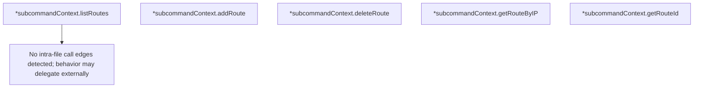

# Behavior Atom: cmd/cloudflared/tunnel/subcommand_context_teamnet.go

## Source Anchor

- Go source: [cloudflare/cloudflared@2026.3.0/cmd/cloudflared/tunnel/subcommand_context_teamnet.go](https://github.com/cloudflare/cloudflared/blob/2026.3.0/cmd/cloudflared/tunnel/subcommand_context_teamnet.go)
- Package: tunnel
- Module group: cmd

## Behavioral Responsibility

CLI command routing and operator-facing behavior surface.

## Entry Points

- No exported/main/init entry point detected; behavior is internal support logic.

## Internal Function Surface

- (*subcommandContext) listRoutes(filter*cfapi.IpRouteFilter) ([]*cfapi.DetailedRoute, error) (line 14)
- (*subcommandContext) addRoute(newRoute cfapi.NewRoute) (cfapi.Route, error) (line 22)
- (*subcommandContext) deleteRoute(id uuid.UUID) error (line 30)
- (*subcommandContext) getRouteByIP(params cfapi.GetRouteByIpParams) (cfapi.DetailedRoute, error) (line 38)
- (*subcommandContext) getRouteId(network net.IPNet, vnetId*uuid.UUID) (uuid.UUID, error) (line 46)

## Input Contract

- func-param:filter *cfapi.IpRouteFilter
- func-param:id uuid.UUID
- func-param:network net.IPNet
- func-param:newRoute cfapi.NewRoute
- func-param:params cfapi.GetRouteByIpParams
- func-param:vnetId *uuid.UUID

## Output Contract

- return:[]*cfapi.DetailedRoute
- return:cfapi.DetailedRoute
- return:cfapi.Route
- return:error
- return:uuid.UUID

## Side Effects and State Transitions

- network I/O

## Branching and Failure Semantics

- Branch density: if=7, switch=0, select=0
- error-return paths

## Import and Dependency Surface

- github.com/cloudflare/cloudflared/cfapi
- github.com/google/uuid
- github.com/pkg/errors
- net

## Go-Impl Flow (Intra-file)

## Rust Porting Notes

- **IP route CRUD**: `listRoutes()`, `addRoute()`, `deleteRoute()`, `getRouteByIP()` → async methods on `TunnelClient` returning `Result<Vec<IpRoute>>` etc.
- **Network type wrapping**: `net.IP` / CIDR parsing → `std::net::IpAddr` / `ipnet::IpNet`.
- **Quirk — 7 if-branches**: Validation + API call error handling; use `?`.

## Accuracy Notes

- Generated from Go AST parsing and source text pattern extraction.
- Source link is authoritative for disputed semantics; keep this atom synchronized with the linked file.
