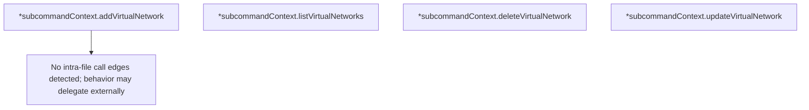

# Behavior Atom: cmd/cloudflared/tunnel/subcommand_context_vnets.go

## Source Anchor

- Go source: [cloudflare/cloudflared@2026.3.0/cmd/cloudflared/tunnel/subcommand_context_vnets.go](https://github.com/cloudflare/cloudflared/blob/2026.3.0/cmd/cloudflared/tunnel/subcommand_context_vnets.go)
- Package: tunnel
- Module group: cmd

## Behavioral Responsibility

CLI command routing and operator-facing behavior surface.

## Entry Points

- No exported/main/init entry point detected; behavior is internal support logic.

## Internal Function Surface

- (*subcommandContext) addVirtualNetwork(newVnet cfapi.NewVirtualNetwork) (cfapi.VirtualNetwork, error) (line 10)
- (*subcommandContext) listVirtualNetworks(filter*cfapi.VnetFilter) ([]*cfapi.VirtualNetwork, error) (line 18)
- (*subcommandContext) deleteVirtualNetwork(vnetId uuid.UUID, force bool) error (line 26)
- (*subcommandContext) updateVirtualNetwork(vnetId uuid.UUID, updates cfapi.UpdateVirtualNetwork) error (line 34)

## Input Contract

- func-param:filter *cfapi.VnetFilter
- func-param:force bool
- func-param:newVnet cfapi.NewVirtualNetwork
- func-param:updates cfapi.UpdateVirtualNetwork
- func-param:vnetId uuid.UUID

## Output Contract

- return:[]*cfapi.VirtualNetwork
- return:cfapi.VirtualNetwork
- return:error

## Side Effects and State Transitions

- No high-signal side effect pattern detected in static scan.

## Branching and Failure Semantics

- Branch density: if=4, switch=0, select=0
- error-return paths

## Import and Dependency Surface

- github.com/cloudflare/cloudflared/cfapi
- github.com/google/uuid
- github.com/pkg/errors

## Go-Impl Flow (Intra-file)

## Rust Porting Notes

- **Virtual network CRUD**: `addVirtualNetwork()`, `listVirtualNetworks()`, `deleteVirtualNetwork()`, `updateVirtualNetwork()` → async API client methods.
- **UUID lookups**: `uuid.Parse()` → `Uuid::parse_str()`.
- **Quirk — 4 if-branches**: Minimal validation; straightforward port.

## Accuracy Notes

- Generated from Go AST parsing and source text pattern extraction.
- Source link is authoritative for disputed semantics; keep this atom synchronized with the linked file.
