# Behavior Atom: cmd/cloudflared/tunnel/subcommands.go

## Source Anchor

- Go source: [cloudflare/cloudflared@2026.3.0/cmd/cloudflared/tunnel/subcommands.go](https://github.com/cloudflare/cloudflared/blob/2026.3.0/cmd/cloudflared/tunnel/subcommands.go)
- Package: tunnel
- Module group: cmd

## Behavioral Responsibility

CLI command routing and operator-facing behavior surface.

## Entry Points

- ParseToken(tokenStr string) (*connection.TunnelToken, error) (line 795)

## Internal Function Surface

- buildCreateCommand() *cli.Command (line 251)
- generateTunnelSecret() ([]byte, error) (line 269)
- createCommand(c *cli.Context) error (line 275)
- tunnelFilePath(tunnelID uuid.UUID, directory string) (string, error) (line 293)
- writeTunnelCredentials(filePath string, credentials *connection.Credentials) error (line 301)
- buildListCommand() *cli.Command (line 315)
- listCommand(c *cli.Context) error (line 338)
- formatAndPrintTunnelList(tunnels []*cfapi.Tunnel, showRecentlyDisconnected bool) (line 422)
- fmtConnections(connections []cfapi.Connection, showRecentlyDisconnected bool) string (line 444)
- buildReadyCommand() *cli.Command (line 468)
- readyCommand(c *cli.Context) error (line 480)
- buildInfoCommand() *cli.Command (line 506)
- tunnelInfo(c *cli.Context) error (line 523)
- getTunnel(sc *subcommandContext, tunnelID uuid.UUID) (*cfapi.Tunnel, error) (line 601)
- formatAndPrintConnectionsList(tunnelInfo Info, showRecentlyDisconnected bool) (line 614)
- tabWriter() *tabwriter.Writer (line 655)
- buildDeleteCommand() *cli.Command (line 668)
- deleteCommand(c *cli.Context) error (line 680)
- renderOutput(format string, v interface{}) error (line 701)
- buildRunCommand() *cli.Command (line 714)
- runCommand(c *cli.Context) error (line 748)
- runNamedTunnel(sc *subcommandContext, tunnelRef string) error (line 808)
- buildCleanupCommand() *cli.Command (line 816)
- cleanupCommand(c *cli.Context) error (line 828)
- buildTokenCommand() *cli.Command (line 846)
- tokenCommand(c *cli.Context) error (line 858)
- buildRouteCommand() *cli.Command (line 899)
- dnsRouteFromArg(c *cli.Context, overwriteExisting bool) (cfapi.HostnameRoute, error) (line 941)
- lbRouteFromArg(c *cli.Context) (cfapi.HostnameRoute, error) (line 958)
- validateName(s string, allowWildcardSubdomain bool) bool (line 989)
- validateHostname(s string, allowWildcardSubdomain bool) bool (line 996)
- routeDnsCommand(c *cli.Context) error (line 1006)
- routeLbCommand(c *cli.Context) error (line 1013)
- routeCommand(c *cli.Context, routeType string) error (line 1020)
- commandHelpTemplate() string (line 1050)
- buildDiagCommand() *cli.Command (line 1076)
- diagCommand(ctx *cli.Context) error (line 1097)

## Input Contract

- CLI flags and command arguments
- func-param:allowWildcardSubdomain bool
- func-param:c *cli.Context
- func-param:connections []cfapi.Connection
- func-param:credentials *connection.Credentials
- func-param:ctx *cli.Context
- func-param:directory string
- func-param:filePath string
- func-param:format string
- func-param:overwriteExisting bool
- func-param:routeType string
- func-param:s string
- func-param:sc *subcommandContext
- func-param:showRecentlyDisconnected bool
- func-param:tokenStr string
- func-param:tunnelID uuid.UUID
- func-param:tunnelInfo Info
- func-param:tunnelRef string
- func-param:tunnels []*cfapi.Tunnel
- func-param:v interface{}
- serialized configuration payloads

## Output Contract

- filesystem writes
- metrics emission
- return:*cfapi.Tunnel
- return:*cli.Command
- return:*connection.TunnelToken
- return:*tabwriter.Writer
- return:[]byte
- return:bool
- return:cfapi.HostnameRoute
- return:error
- return:string
- stdout/stderr or structured logs

## Side Effects and State Transitions

- network I/O
- filesystem I/O
- subprocess execution

## Branching and Failure Semantics

- Branch density: if=88, switch=4, select=0
- error-return paths
- fallback/default branches

## Import and Dependency Surface

- crypto/rand
- encoding/base64
- encoding/json
- fmt
- github.com/cloudflare/cloudflared/cfapi
- github.com/cloudflare/cloudflared/cmd/cloudflared/cliutil
- github.com/cloudflare/cloudflared/cmd/cloudflared/flags
- github.com/cloudflare/cloudflared/cmd/cloudflared/updater
- github.com/cloudflare/cloudflared/config
- github.com/cloudflare/cloudflared/connection
- github.com/cloudflare/cloudflared/diagnostic
- github.com/cloudflare/cloudflared/fips
- github.com/cloudflare/cloudflared/metrics
- github.com/google/uuid
- github.com/mitchellh/go-homedir
- github.com/pkg/errors
- github.com/urfave/cli/v2
- github.com/urfave/cli/v2/altsrc
- golang.org/x/net/idna
- gopkg.in/yaml.v3
- io
- net/http
- os
- path/filepath
- regexp
- sort
- strings
- text/tabwriter
- time

## Go-Impl Flow (Intra-file)

```mermaid
flowchart TD
    F1["buildCreateCommand"]
    F2["generateTunnelSecret"]
    F3["createCommand"]
    F4["tunnelFilePath"]
    F5["writeTunnelCredentials"]
    F6["buildListCommand"]
    F7["listCommand"]
    F8["formatAndPrintTunnelList"]
    F9["fmtConnections"]
    F10["buildReadyCommand"]
    F11["readyCommand"]
    F12["buildInfoCommand"]
    F13["tunnelInfo"]
    F14["getTunnel"]
    F15["formatAndPrintConnectionsList"]
    F16["tabWriter"]
    F17["buildDeleteCommand"]
    F18["deleteCommand"]
    F19["renderOutput"]
    F20["buildRunCommand"]
    F21["runCommand"]
    F22["ParseToken"]
    F23["runNamedTunnel"]
    F24["buildCleanupCommand"]
    F25["cleanupCommand"]
    F26["buildTokenCommand"]
    F27["tokenCommand"]
    F28["buildRouteCommand"]
    F29["dnsRouteFromArg"]
    F30["lbRouteFromArg"]
    F31["validateName"]
    F32["validateHostname"]
    F33["routeDnsCommand"]
    F34["routeLbCommand"]
    F35["routeCommand"]
    F36["commandHelpTemplate"]
    F37["buildDiagCommand"]
    F38["diagCommand"]
    F1 --> F36
    F6 --> F36
    F7 --> F19
    F7 --> F8
    F8 --> F16
    F8 --> F9
    F10 --> F36
    F12 --> F36
    F13 --> F14
    F13 --> F19
    F13 --> F15
    F15 --> F16
    F15 --> F9
    F17 --> F36
    F20 --> F36
    F21 --> F22
    F21 --> F23
    F24 --> F36
    F26 --> F36
    F27 --> F5
    F28 --> F36
    F29 --> F32
    F30 --> F32
    F30 --> F31
    F32 --> F31
    F33 --> F35
    F34 --> F35
    F35 --> F29
    F35 --> F30
    F37 --> F36
```

## Accuracy Notes

- Generated from Go AST parsing and source text pattern extraction.
- Source link is authoritative for disputed semantics; keep this atom synchronized with the linked file.

## Rust Porting Notes

- **CLI subcommands**: `urfave/cli/v2` subcommand registration → `clap` derive macros with `#[command(subcommand)]` enum variants for create, delete, list, route, token, etc.
- **Token parsing**: `ParseToken` base64-decodes a tunnel token → `base64::engine::general_purpose::STANDARD.decode()` + `serde_json::from_slice`.
- **API client**: `cfapi` client for tunnel CRUD → `reqwest::Client` with typed request/response structs.
- **IDN handling**: `golang.org/x/net/idna` for hostname normalization → `idna` crate for IDNA2008 processing.
- **YAML config**: `gopkg.in/yaml.v3` → `serde_yaml` for config file round-tripping.
- **Tabwriter output**: `text/tabwriter` for formatted CLI output → `tabwriter` or `comfy-table` crate.
- **Quirk — 88 if-branches**: The highest branch density of any atom; decompose into per-subcommand handler functions in Rust and use enum dispatch rather than conditional chains.
- **Quirk — regex for hostname validation**: `regexp` usage → `regex` crate; compile patterns lazily with `std::sync::LazyLock`.
