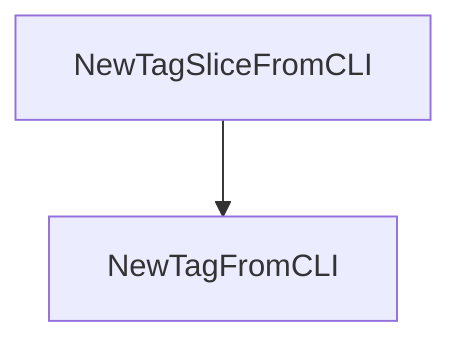

# Behavior Atom: cmd/cloudflared/tunnel/tag.go

## Source Anchor

- Go source: [cloudflare/cloudflared@2026.3.0/cmd/cloudflared/tunnel/tag.go](https://github.com/cloudflare/cloudflared/blob/2026.3.0/cmd/cloudflared/tunnel/tag.go)
- Package: tunnel
- Module group: cmd

## Behavioral Responsibility

CLI command routing and operator-facing behavior surface.

## Entry Points

- NewTagFromCLI(compoundTag string) (pogs.Tag, bool) (line 14)
- NewTagSliceFromCLI(tags []string) ([]pogs.Tag, error) (line 22)

## Internal Function Surface

- None detected.

## Input Contract

- func-param:compoundTag string
- func-param:tags []string

## Output Contract

- return:[]pogs.Tag
- return:bool
- return:error
- return:pogs.Tag

## Side Effects and State Transitions

- No high-signal side effect pattern detected in static scan.

## Branching and Failure Semantics

- Branch density: if=2, switch=0, select=0
- No explicit failure pattern markers found in static scan.

## Import and Dependency Surface

- fmt
- github.com/cloudflare/cloudflared/tunnelrpc/pogs
- regexp

## Go-Impl Flow (Intra-file)

## Rust Porting Notes

- **Regex-based tag parsing**: `NewTagFromCLI()` parses `key=value` strings via regex → `regex::Regex` or simple `str::split_once('=')` for key-value extraction.
- **Pogs type conversion**: Tags map to Cap'n Proto pogs types → `From<CliTag>` impl converting to the RPC tag type.
- **Quirk — 2 if-branches**: Minimal validation; direct port.

## Accuracy Notes

- Generated from Go AST parsing and source text pattern extraction.
- Source link is authoritative for disputed semantics; keep this atom synchronized with the linked file.
