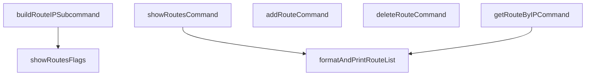

# Behavior Atom: cmd/cloudflared/tunnel/teamnet_subcommands.go

## Source Anchor

- Go source: [cloudflare/cloudflared@2026.3.0/cmd/cloudflared/tunnel/teamnet_subcommands.go](https://github.com/cloudflare/cloudflared/blob/2026.3.0/cmd/cloudflared/tunnel/teamnet_subcommands.go)
- Package: tunnel
- Module group: cmd

## Behavioral Responsibility

CLI command routing and operator-facing behavior surface.

## Entry Points

- No exported/main/init entry point detected; behavior is internal support logic.

## Internal Function Surface

- buildRouteIPSubcommand() *cli.Command (line 28)
- showRoutesFlags() []cli.Flag (line 92)
- showRoutesCommand(c *cli.Context) error (line 99)
- addRouteCommand(c *cli.Context) error (line 131)
- deleteRouteCommand(c *cli.Context) error (line 183)
- getRouteByIPCommand(c *cli.Context) error (line 223)
- formatAndPrintRouteList(routes []*cfapi.DetailedRoute) (line 262)

## Input Contract

- CLI flags and command arguments
- func-param:c *cli.Context
- func-param:routes []*cfapi.DetailedRoute

## Output Contract

- return:*cli.Command
- return:[]cli.Flag
- return:error
- stdout/stderr or structured logs

## Side Effects and State Transitions

- network I/O
- subprocess execution

## Branching and Failure Semantics

- Branch density: if=29, switch=0, select=0
- error-return paths

## Import and Dependency Surface

- fmt
- github.com/cloudflare/cloudflared/cfapi
- github.com/cloudflare/cloudflared/cmd/cloudflared/cliutil
- github.com/cloudflare/cloudflared/cmd/cloudflared/updater
- github.com/google/uuid
- github.com/pkg/errors
- github.com/urfave/cli/v2
- net
- os
- text/tabwriter

## Go-Impl Flow (Intra-file)

## Rust Porting Notes

- **Route CLI commands**: `showRoutesCommand()`, `addRouteCommand()`, `deleteRouteCommand()` with tabwriter output → `clap` subcommands + `tabled` or `comfy-table` crate for formatted table display.
- **Quirk — 29 if-branches**: Validation + formatting; decompose into `format_route_table()` helper and per-command handlers.

## Accuracy Notes

- Generated from Go AST parsing and source text pattern extraction.
- Source link is authoritative for disputed semantics; keep this atom synchronized with the linked file.
