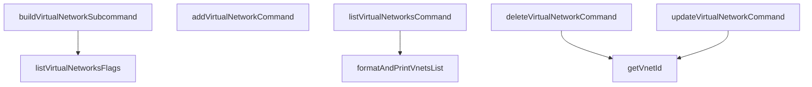

# Behavior Atom: cmd/cloudflared/tunnel/vnets_subcommands.go

## Source Anchor

- Go source: [cloudflare/cloudflared@2026.3.0/cmd/cloudflared/tunnel/vnets_subcommands.go](https://github.com/cloudflare/cloudflared/blob/2026.3.0/cmd/cloudflared/tunnel/vnets_subcommands.go)
- Package: tunnel
- Module group: cmd

## Behavioral Responsibility

CLI command routing and operator-facing behavior surface.

## Entry Points

- No exported/main/init entry point detected; behavior is internal support logic.

## Internal Function Surface

- buildVirtualNetworkSubcommand(hidden bool) *cli.Command (line 44)
- listVirtualNetworksFlags() []cli.Flag (line 110)
- addVirtualNetworkCommand(c *cli.Context) error (line 117)
- listVirtualNetworksCommand(c *cli.Context) error (line 161)
- deleteVirtualNetworkCommand(c *cli.Context) error (line 193)
- updateVirtualNetworkCommand(c *cli.Context) error (line 220)
- getVnetId(sc *subcommandContext, input string) (uuid.UUID, error) (line 257)
- formatAndPrintVnetsList(vnets []*cfapi.VirtualNetwork) (line 279)

## Input Contract

- CLI flags and command arguments
- func-param:c *cli.Context
- func-param:hidden bool
- func-param:input string
- func-param:sc *subcommandContext
- func-param:vnets []*cfapi.VirtualNetwork

## Output Contract

- return:*cli.Command
- return:[]cli.Flag
- return:error
- return:uuid.UUID
- stdout/stderr or structured logs

## Side Effects and State Transitions

- subprocess execution

## Branching and Failure Semantics

- Branch density: if=25, switch=0, select=0
- error-return paths

## Import and Dependency Surface

- fmt
- github.com/cloudflare/cloudflared/cfapi
- github.com/cloudflare/cloudflared/cmd/cloudflared/cliutil
- github.com/cloudflare/cloudflared/cmd/cloudflared/updater
- github.com/google/uuid
- github.com/pkg/errors
- github.com/urfave/cli/v2
- os
- text/tabwriter

## Go-Impl Flow (Intra-file)

## Rust Porting Notes

- **VNet CLI commands**: `addVirtualNetworkCommand()`, `listVirtualNetworksCommand()` with tabwriter → `clap` subcommands + `comfy-table` for output formatting.
- **Quirk — 25 if-branches**: Same pattern as teamnet subcommands; decompose into `format_vnet_table()` helper.

## Accuracy Notes

- Generated from Go AST parsing and source text pattern extraction.
- Source link is authoritative for disputed semantics; keep this atom synchronized with the linked file.
