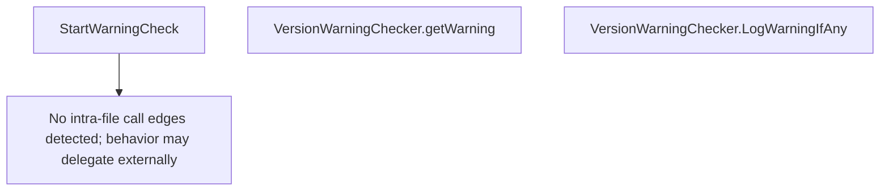

# Behavior Atom: cmd/cloudflared/updater/check.go

## Source Anchor

- Go source: [cloudflare/cloudflared@2026.3.0/cmd/cloudflared/updater/check.go](https://github.com/cloudflare/cloudflared/blob/2026.3.0/cmd/cloudflared/updater/check.go)
- Package: updater
- Module group: cmd

## Behavioral Responsibility

CLI command routing and operator-facing behavior surface.

## Entry Points

- StartWarningCheck(c *cli.Context) VersionWarningChecker (line 12)
- (VersionWarningChecker) LogWarningIfAny(log *zerolog.Logger) (line 45)

## Internal Function Surface

- (VersionWarningChecker) getWarning() string (line 35)

## Input Contract

- CLI flags and command arguments
- func-param:c *cli.Context
- func-param:log *zerolog.Logger

## Output Contract

- return:VersionWarningChecker
- return:string
- stdout/stderr or structured logs

## Side Effects and State Transitions

- concurrency primitives

## Branching and Failure Semantics

- Branch density: if=2, switch=0, select=1
- error-return paths
- fallback/default branches

## Import and Dependency Surface

- github.com/rs/zerolog
- github.com/urfave/cli/v2

## Go-Impl Flow (Intra-file)

## Rust Porting Notes

- **Async warning check**: `StartWarningCheck()` spawns goroutine to check version → `tokio::spawn(async { check_version().await })` returning a `JoinHandle<Option<String>>`.
- **Quirk — select with 1 branch**: Context-guarded check; translate to `tokio::time::timeout()` or `tokio::select!` with cancellation.

## Accuracy Notes

- Generated from Go AST parsing and source text pattern extraction.
- Source link is authoritative for disputed semantics; keep this atom synchronized with the linked file.
